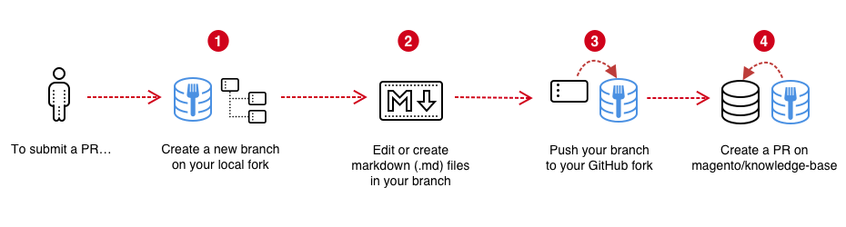

## Contribute to Magento Support Knowledge base

Share your troubleshooting tips and best practices with the community by contributing to [Magento Support Knowledge Base](https://support.magento.com/hc/en-us) (Support KB)!
You can contribute by creating an issue or pull request (PR) on our [Support KB](https://github.com/magento/knowledge-base) GitHub repository.
We welcome all types of contributions; from minor typo fixes to new topics.

Support KB staff members review issues and pull requests on a regular basis. We do our best to address all issues as soon as possible, but working through the backlog takes time. We appreciate your patience.

## Rewards for contributions

Support KB works with Magento Community Engineering teams and projects.
As you contribute PRs, you gain [Contribution Points](../docs/contribution-points.md).


## Get started


1. Make sure you have a [GitHub account](https://github.com/signup/free).

    **Note for partners:** Add [2FA](https://devdocs.magento.com/contributor-guide/contributing.html#two-factor) protection when contributing to Magento repositories.

1. [Fork](https://help.github.com/articles/fork-a-repo/) the [Support KB repository](https://github.com/magento/knowledge-base). Remember to [sync your fork](https://help.github.com/articles/syncing-a-fork/) and update branches as needed.
1. Review the [Support KB guidelines below](#contribution-guidelines).


## Contribute

The following diagram shows the contribution workflow:




### Create a branch

1. Create a new branch from your fork using a name that best describes the work or references a GitHub issue number.
1. Edit or create markdown (`.md`) files in your branch.
1. Push your branch to your fork.

### Create a pull request

1. Create a pull request to the [magento/knowledge-base](https://github.com/magento/knowledge-base) repository. Use `main` as the base branch when creating a PR.

1. Complete the pull request providing the information listed in the template.

    **We will close your pull request if you do not provide the information described in the template.**

1. After creating a pull request, a Support KB staff member will review it and may ask you to make revisions.

    **We will close your pull request if you do not respond to feedback in two weeks.**

**Note:** If you have not signed the [Adobe Contributor License Agreement](https://opensource.adobe.com/cla.html), the pull request provides a link. You must sign the CLA before we can accept your contribution.

## General contribution guidelines

* Review existing [pull requests](https://github.com/magento/knowledge-base/pulls) and [issues](https://github.com/magento/knowledge-base/issues) to avoid duplicating work.
* For large contributions, or changes that include multiple files, [open an issue](#report-an-issue) and discuss it with us first. This helps prevent duplicate or unnecessary work.
* Do not make global find-and-replace changes without first [creating an issue](https://github.com/magento/knowledge-base/issues/new/choose) and discussing it with us. Global changes can have unintended consequences.
* Combine multiple small changes (such as minor editorial and technical changes) into a single pull request. This helps us efficiently and effectively facilitate your contribution.
* Review your work for basic typos, formatting errors, or ambiguous sentences before opening a pull request.

## Specific contribution guidelines

The following guidelines may answer most of your questions and help you get started.

### Dos:

* Write content using Markdown. See [Support KB formatting](../docs/guides/kb-formatting-guide.md) for details.
* Please follow the style recommendations described in [Support KB Styleguide](../docs/guides/support-kb-styleguide.md).
* Use [article templates](../docs/article-templates/) when adding new articles.
* Follow the recommended file structure and file naming convention described further.

### Don'ts

* Do not make changes to content in the Announcements and Support Tools folders.
* Do not remove/change the HTML formatting mentioned as required in [Support KB formatting](../docs/guides/kb-formatting-guide.md).
* Do not remove/change the HTML formatting in Troubleshooters articles. Examples:
    * [Redis troubleshooter](https://support.magento.com/hc/en-us/articles/360046673932)
    * [Magento Fastly troubleshooter](https://support.magento.com/hc/en-us/articles/360040759292-Magento-Fastly-troubleshooter)


## File structure {#file_structure}

All .md files should go to sections folders, nested in category folders under the "src" folder.
All images and any other attachments should go to "assets" folders inside the section folders.


### Artilce files naming convention

File names correspond to article titles. So file names appear as articles titles on [support.magento.com](https://support.magento.com/hc/en-us).

### Image files naming

If you add images to your articles, please follow this convention to name your image files:

* Specify version of the product which is represented on the screenshot. If it is not Magento Commerce, add name of the product to the file name.
* Relay what is being captured by the image, for example a screenshot of Magento Commerce Price Rule configuration would be cart-price-rule-new-231.png, cart-price-rule-saved-231.png etc. Check for existing images to follow the naming patterns.
* Lower case.
* Words should be separated by hyphen "-", not underscore "_".
* Use existing naming patterns. Check the existing file names under /assets folders as an example.

### Metadata

The Markdown (.md) file's metadata is a set of YAML key-value pairs. The metadata section is located at the top of each file.

```yaml
---
title:
labels:
---
```

> Key-value pair reference:

| Property  | Description |
| ------------- | ---------- |
| `title`       | Defines the article title. If using any [YAML special characters](https://support.asg.com/mob/mvw/10_0/mv_ag/using_quotes_with_yaml_special_characters.htm) in title, please enclose it in quotes ("")|
| `labels` | Contains labels that will be added to the article in Magento Help Center. Add labels to describe products, issues, products versions, section and category.  If in doubt, don't add labels. |


### Add article

To add an article, create a new markdown file in the desired category + section. Articles must include the standard metadata table with title and labels. Labels can be omitted.

### Edit article content
You can rename article, edit its content, labels or links to files.

#### Rename article

To rename the article update the title in the article's metadata. It will reflect in [Support Help Center](https://support.magento.com/hc/en-us) exactly as written in the metadata. Non-ASCII characters are not allowed in metadata.

#### Add/Edit/Delete article labels

To add, edit, or delete article labels (tags) update the labels portion of the metadata.

#### Edit article body

To edit the article body, edit the body within your editor. Follow our [Formatting guide](../docs/guides/kb-formatting-guide.md).

### Move article into different section

To move an article into a different section, move the file into the appropriate section. Do not move your article directly into a category folder. This will result in errors.

### Delete article

To delete an article, delete the article file.

## Report an issue

If you find a typo or errors in Magento Support Knowledge Base article, you can either correct it and deliver changes with a pull request (as described above) or you can report it by creating an issue in the Support KB repository.

You must complete the issue template. We will close your issue if you fail to provide the information listed template. Enter as much information as you can, including content corrections, steps to reproduce, command or code updates, or questions for clarifications.

**Note:** Check the existing [issues](https://github.com/magento/knowledge-base/issues) on GitHub to see if someone has already reported the issue.


Thank you for contributing your brilliance to Magento Support Knowledge Base!!
