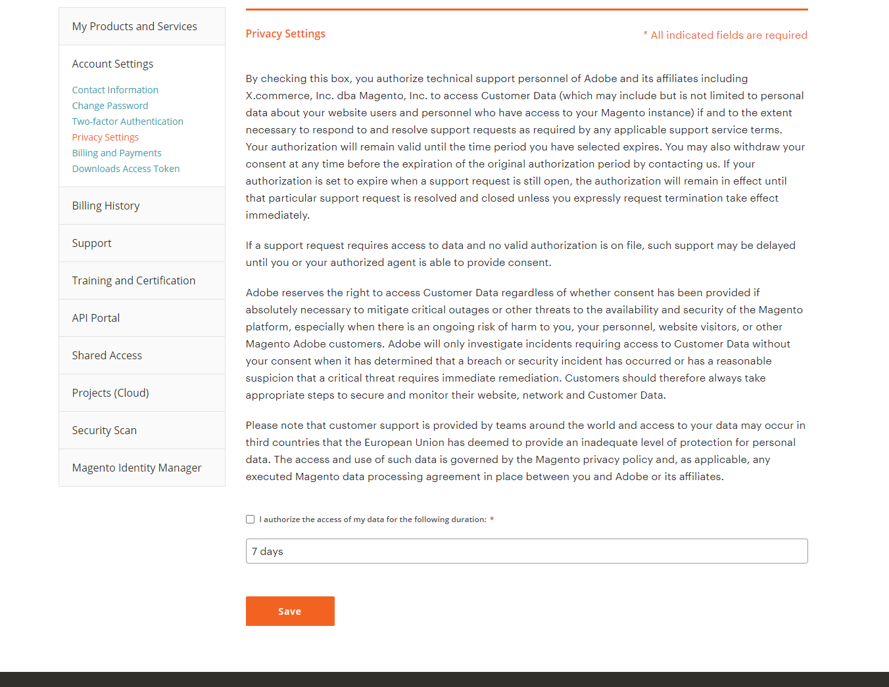

Adobe technical support may require access to your Adobe Commerce-related data in order to provide support. Authorization can only be provided by the primary Adobe Commerce account holder in their Adobe Commerce account privacy settings if they choose to do so. Allowing this access prior to support request creation will help ensure the issue can be properly investigated and/or help increase the speed of resolution. Please note, the "Project Owner" of an Adobe Commerce Cloud project may not be the primary Adobe Commerce account holder.

>![info]
>
>Privacy Settings tab will only be available/visible to users with support entitlements associated with a paid/purchased product, and to users who are the primary MageID and directly entitled; this tab is not available for delegation to another user via Shared Access. After granting access, it can take 5-10 minutes for all internal Adobe systems to be updated. If access was not granted prior to ticket submission, the primary account owner would need to update the ticket with explicit data access consent.

To authorize access:

1. [Log in](https://account.magento.com/customer/account/login) as a support entitled primary user.
1. On the **My Account** page > **Account Settings** > **Privacy Settings.** You will see a consent form to grant Adobe technical support personnel access to your data.
1. After reviewing the information about privacy settings choose whether to check the checkbox next to **I authorize the access of my data for the following duration:**.
1. In the duration drop-down, select the period of time you want Adobe technical support personnel to have access to your customer data. You can select 7 days, 30 days, one year or indefinitely.
1. Click **Save**. This will update the start and end date at the bottom of the page under **You have given consent for the following duration** (screen shot). After consent has been granted, the entitled primary user will see the option to withdraw consent at the bottom of the screen.
      

You can click **Withdraw Consent** at any time to withdraw your consent for Adobe support personnel to have access to your data.
