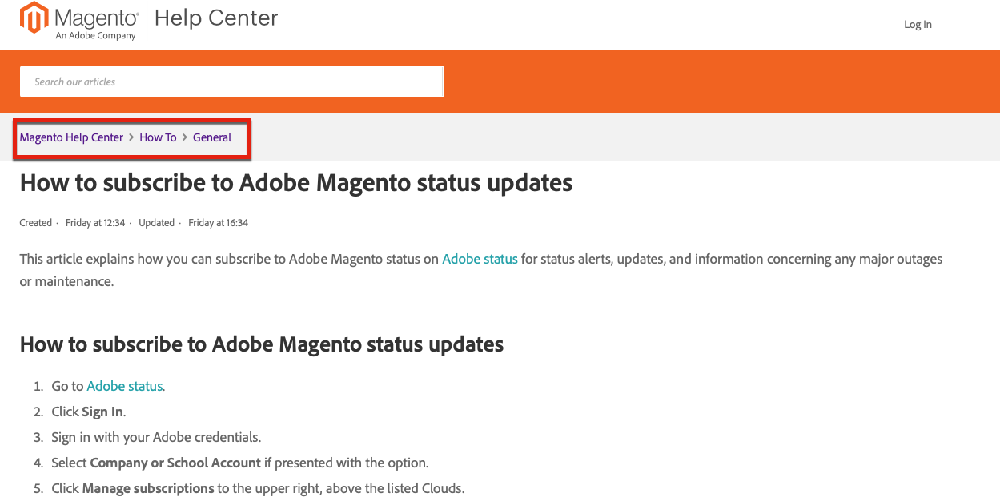

Starting June 15th, the Adobe Commerce Support Knowledge Base team starts accepting direct edits and new article contributions from external Adobe Commerce community through the [magento/knowledge-base](https://github.com/magento/knowledge-base) GitHub repo!

Noticed a typo in one of our articles or incomplete troubleshooting steps?
You can now fix it yourself and get contribution points!

## Contribute

We welcome all kinds of contributions, from minor typo corrections to complete troubleshooting articles. Contributing to this repo gets you reward points, similar to contributing to Adobe Commerce code and our developer documentation. See [Contribution reward points](https://github.com/magento/knowledge-base/blob/main/docs/contribution-points.md) for details.

### General contribution flow

1. Fork this repo.
1. Make edits on forked repo.
1. Submit a Pull Request (PR) to this repo.
1. Tests are run:
    * Adobe CLA - making sure the Adobe Open Source Contributor License Agreement is signed.
    * Markdown Linting test - making sure markdown syntax is correct.
    * File structure validation test - making sure the commit is done according to the [required file structure](https://github.com/magento/knowledge-base/blob/main/.github/CONTRIBUTING.md#file_structure).
1. PR approvals flow:
    1. The support knowledge base (KB) writers review the PR within several days' time frame and add labels.
    1. KB writer can approve/deny/request changes.
    1. If approved, KB writer adds labels corresponding to the level of input provided in PR and internal subject matter expert (SME) reviews the PR.
    1. SME can approve/deny/request changes.
1. Once all corrections are done (if any requested), and both the KB writer and SME approve the PR, the KB writer imports content to the internal repo and merges it internally.
1. The [magento/knowledge-base](https://github.com/magento/knowledge-base) repo synchronizes with the internal one in 20 minutes.
1. Once the repos are synced, your PR gets closed and you get [contribution points](#contribution-points).

For details on contribution flow, please refer to the [Contributor's Guide](https://github.com/magento/knowledge-base/blob/main/.github/CONTRIBUTING.md).
For templates, style guide, and formatting guidelines, please refer to [Documentation](https://github.com/magento/knowledge-base/tree/main/docs).

### Find the Support KB article file on Github

In the Support Knowledge Base (KB), articles are organized in sections, which nest under categories.

For example, the [How to subscribe to Adobe Magento status updates](https://support.magento.com/hc/en-us/articles/4402858335373-How-to-subscribe-to-Adobe-Magento-status-updates) article belongs to the General section in the How To category.

You can see the section and category name in the breadcrumbs path on the article page, see the image below:

Article files are organized the same way in the [magento/knowledge-base](https://github.com/magento/knowledge-base) repo.
All the content is stored in the `src` folder, with folders for categories and nested folders for sections; file names either coincide with article titles or are similar.

You might also use search inside the repo using a piece of text from the Support KB article as a search string. When the search returns files, containing this string, make sure to choose the file that belongs to the right section and category.  

### Contribution points

The [magento/knowledge-base](https://github.com/magento/knowledge-base) repo in integrated with Magento Community Engineering for contribution points and support.

Please refer to [Contribution Points](https://github.com/magento/knowledge-base/blob/main/docs/contribution-points.md) document to see how points are rewarded.
