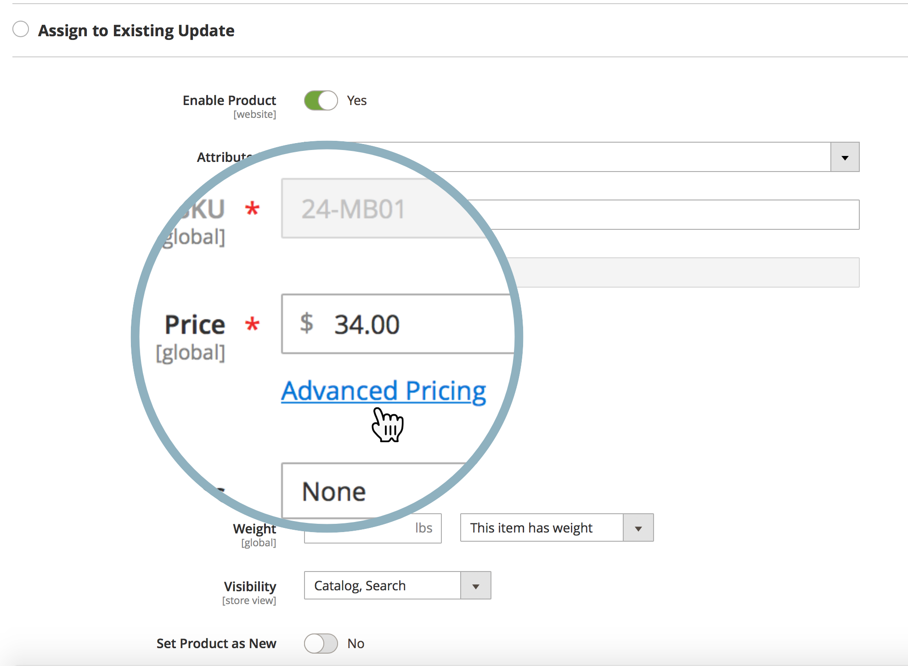

Adobe Commerce does not offer the functionality of scheduling a price update ([Content Staging](http://docs.magento.com/m2/ee/user_guide/cms/content-staging.html)) for one or more products in a shared catalog.

That means you cannot schedule such a price update directly from the **Set Pricing and Structure** menu of the Commerce Admin panel (there is no **Schedule New Update** button in this menu).

Still, you may use alternative methods and schedule a price update for:

* a customer group
* the product's base price

## Schedule price update for a customer group

1. Start [scheduling a new product update](http://docs.magento.com/m2/ee/user_guide/cms/content-staging-scheduled-update.html).
1. Scroll down to the **Price** field and click **Advanced Pricing**.       

    

1. In the **Customer Group Price section**, select the needed Customer Group and set the updated price.

    

1. Finish scheduling the update as usual.

In this workflow, you can only update the price for a single product; bulk price update is not available.

Remember: shared catalogs leverage the customer group pricing.

 **Related documentation**

* [Scheduling an update (Content Staging)](http://docs.magento.com/m2/ee/user_guide/cms/content-staging-scheduled-update.html) in our user guide.
* [Advanced Pricing](http://docs.magento.com/m2/ee/user_guide/catalog/pricing-advanced.html) in our user guide.

## Schedule price update for the base price

See the related article: [How base price change affects the shared catalog price?](https://support.magento.com/hc/en-us/articles/360001571314) in our support knowledge base.
