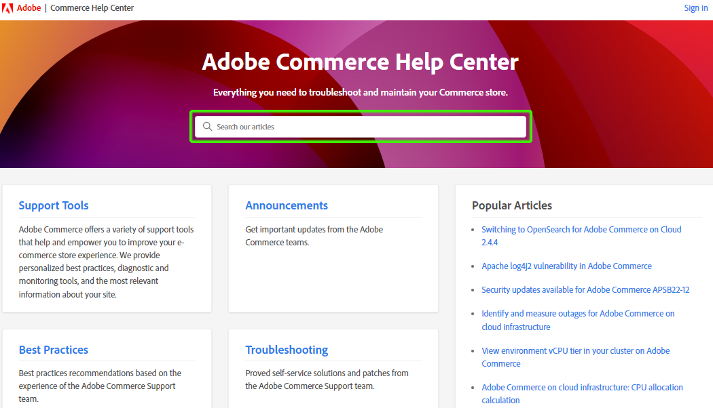
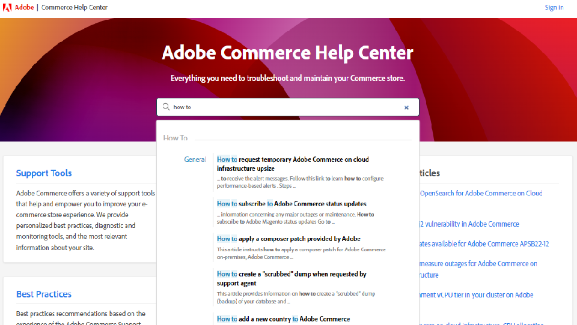
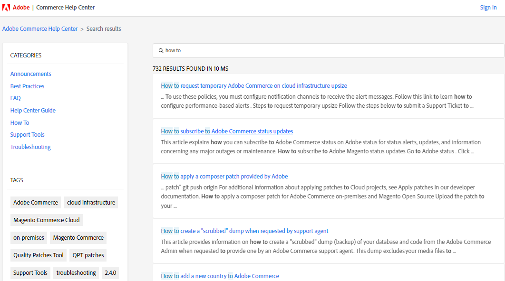
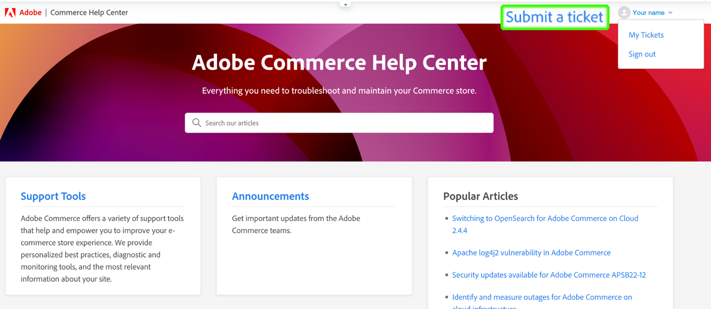
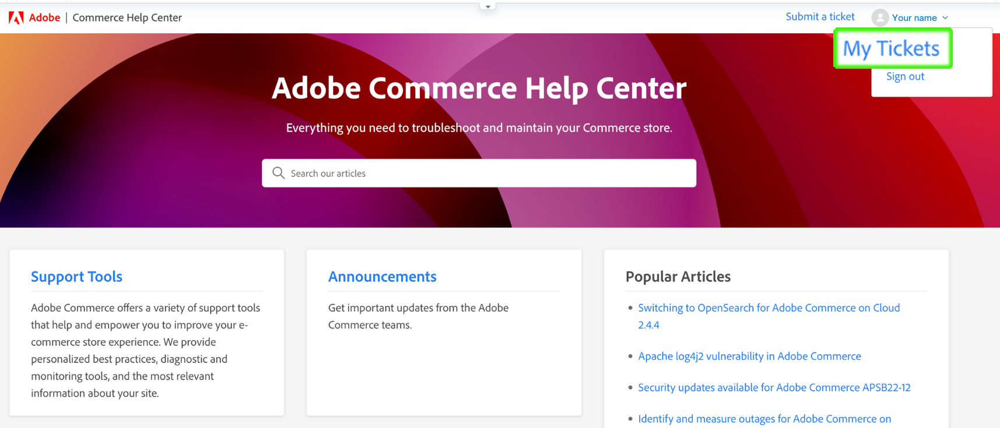
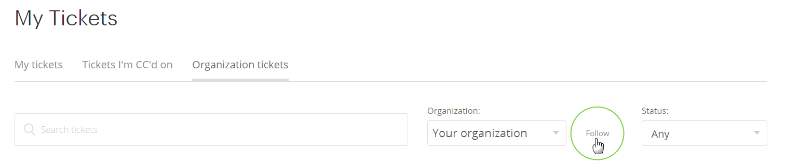

Learn how to submit a support ticket to the Adobe Commerce Help Center, provide shared access to accounts, and navigate the Adobe Commerce Knowledge Base.

**Major Update:** July 17, 2020

**[WHAT IS ADOBE COMMERCE HELP CENTER?](#what-is)**  

**[KNOWLEDGE BASE](#kb)**

* [What is Knowledge Base?](#what-is-kb)
* [Knowledge Base does not replace DevDocs or User Guide](#kb-devdocs-user-guide)
* [Search for articles](#search-for-articles)
* [Navigate articles using Categories](#navigate-articles)
* [Rate articles](#rate-articles)

**[SUPPORT TICKETS](#support-tickets)**

* [Log In To Help Center](#login)
* [Submit a support ticket](#submit-ticket)
    * [Help Center start page](#submit-ticket-help-center-start-page)
    * [Magento Account page](#submit-ticket-magento-account-page)
    * [Magento Cloud Account page](#submit-ticket-magento-cloud-account-page)
    * [Information in your support ticket](#info-in-support-ticket)
    * ["Submit a ticket" link not displayed on Adobe Commerce Help Center start page](#no-submit-link)
    * [*"Please verify your email address"* error on Magento Account page](#verify-email-address)
    * [Ticket submission form: merchant is not displayed in Organization drop-down](#merchant-not-displayed)
* [Track your tickets](#track-tickets)
* [Adobe Commerce P1 hotline (Login Required)](#P1-hotline)
* [Support ticket fields explained](#ticket-fields-explained)
* [Ticket status: How your requests are processed](#ticket-status)
* [Conversation in your ticket](#conversation-in-ticket)
* [Resolve your ticket](#resolve-ticket)
* [Open a follow-up ticket](#follow-up)

**[SHARED ACCESS: GRANT PRIVILEGES FOR OTHER USERS TO ACCESS YOUR ACCOUNT](#shared-access)**

* [Who can provide shared access](#who-can-provide-shared-access)
* [Find out who is your Account Owner (Cloud)](#find-account-owner-cloud)
* [Provide shared access](#provide-shared-access)
* [Revoke (delete) shared access](#revoke-shared-access)
* [Access shared account (switch accounts)](#switch-accounts)
* [Shared access troubleshooting](#troubleshooting-shared-access)

**[BILLING FAQ FOR ADOBE COMMERCE](#billing-faq)**

**[MAGENTO U IS NOW PART OF ADOBE DIGITAL LEARNING SERVICES](#magento-u)**

<h2 id="what-is">WHAT IS ADOBE COMMERCE HELP CENTER?</h2>

Welcome to Adobe Commerce Help Center! We are here to help solve your Adobe Commerce issues quickly and efficiently.

Adobe Commerce Help Center is the [Knowledge Base](#kb) and the [Ticketing System](#support-tickets). This document shows how to use both of them.

<h2 id="kb">KNOWLEDGE BASE</h2>

When you access the Help Center, you first get to the Adobe Commerce Knowledge Base.

<h3 id="what-is-kb">What is Knowledge Base?</h3>

The Adobe Commerce Support Knowledge Base is a collection of articles based on the support tickets that Adobe Commerce Customers or Partners submit.

Every Knowledge Base article covers a real-life issue or question and may be viewed as a reply to a submitted support ticket helping others to solve a similar problem.

<h3 id="kb-devdocs-user-guide">Knowledge Base does not replace DevDocs or User Guide</h3>

The information in the Knowledge Base is designed as complementary to [DevDocs](http://devdocs.magento.com/), the [User Guide](http://docs.magento.com/m2/ee/user_guide/getting-started.html), and [other Adobe Commerce publications](https://magento.com/resources/technical), and only covers troubleshooting, best practices, hosts announcements, answers FAQ's, or highlights specific scenarios that have not been mentioned (for any reason) in the official documentation.

<h3 id="search-for-articles">Search for articles</h3>

You don't need to be logged in to the Adobe Commerce Help Center to search for articles in the Adobe Commerce Knowledge Base.

To search for articles, follow these steps:

1. Go to the Knowledge Base landing page at <https://support.magento.com/hc/en-us>.
1. In the **Search** field, start entering the keywords that an article should have. For example, *Redis*, *error*, *configuration management*, etc.

    
1. The top article suggestions are displayed below the **Search** field.
1. Select an article from the list and click it.

    
1. If you want the results of your search to be displayed on a new page:
    * Do not select an article from the suggestion list
    * After typing your search query, press Enter on your keyboard

        

The search is not limited to the article title but also includes the article text; the most relevant matches are displayed first.

You can also select the article **Tags** on the bottom-left of the Search results page to select articles with those specific word tags that you are searching for.

You can search for articles using the **Search** field on any page of the Knowledge Base.

<h3 id="navigate-articles">Navigate articles using Categories</h3>

All articles in the Knowledge Base are grouped into Categories. They are:

* **Announcements:** articles with timely news and helpful information.
* **Best Practices:** articles with recommended techniques and procedures that are prescribed as most effective.
* **Troubleshooting:** articles that show how to solve a particular issue. For example, if you cannot perform an operation because of an error message, this is where you might find the solution.
* **How To:** articles with detailed steps on how to perform a particular operation.
* **FAQ:** answers to the most common, frequently asked questions.

To find articles through navigating the categories, follow these steps:

1. Go to the Knowledge Base landing page at <https://support.magento.com/hc/en-us>.
1. Click a category.
1. The list of all articles in that category is displayed. Browse through the articles, find the one you need, then click it.

<h3 id="rate-articles">Rate articles</h3>

You may help us improve our articles by letting us know your opinion. At the bottom of every article, click **Yes** or **No** to answer the question **Was this article helpful?**

Please vote, your opinion matters!

<h2 id="support-tickets">SUPPORT TICKETS</h2>

Adobe Commerce Ticketing System allows working with support tickets to address the particular issues you are experiencing while working with Adobe Commerce — for all Adobe Commerce products.

<h2 id="login">LOG IN TO HELP CENTER</h2>

Logging in allows you to work with support tickets. You can still access all articles in the Adobe Commerce Knowledge Base without logging in.

To log in to the Adobe Commerce Help Center, follow these steps:

1. Access the Help Center at <https://support.magento.com>.
1. Click **Log In** in the upper-right corner.

Use your Magento Account credentials to log in. For more information, see [Your Magento Account](http://docs.magento.com/m2/ee/user_guide/magento/magento-account.html) in our user guide.

<h3 id="submit-ticket"><strong>Submit a support ticket</strong></h3>

Once successfully logged in, you may submit a support ticket using the Help Center start page, your Magento Account page, and your Magento Cloud Account page.

* If you are the **Account Owner** follow the steps below.
* If you are a **Shared Access user, you must switch accounts first** [Access shared account (switch accounts)](#switch-accounts), and then you may proceed to the steps below.

<h4 id="submit-ticket-help-center-start-page">Help Center start page</h4>

To submit a new support ticket using the starting page of Adobe Commerce Help Center, follow these steps:

1. Go to [Adobe Commerce Help Center](https://support.magento.com/hc/en-us).
1. Click **Submit a ticket** at the upper-right corner.

    
1. Fill in the fields.
1. Click **Submit**.

You **must log in** to the Help Center using your Magento Account in order to submit a support ticket. Until you are logged in, [the **Submit a ticket** button will not be displayed](#no-submit-link).

<h4 id="submit-ticket-magento-account-page">Magento Account page</h4>

To submit a new support ticket using your Magento Account page, follow these steps:

1. Log in to your Magento Account. See [detailed instructions](http://docs.magento.com/m2/ee/user_guide/magento/magento-account-create.html) in our user guide.
1. Click the **Support** tab.    

    
1. The Help Center start page loads for you.
1. Click **Submit a ticket** in the upper-right corner.
1. Fill in the fields.
1. Click **Submit**.

<h4 id="submit-ticket-magento-cloud-account-page">Magento Cloud Account page</h4>

To submit a new support ticket using your Magento Cloud Account page, follow these steps:

1. Log in to your [Magento Cloud Account](https://account.magento.com/cloud/customer/login/).
1. Click the **Support** link at the top of the page.
1. The Help Center start page loads for you.
1. Click **Submit a ticket** in the upper-right corner.
1. Fill in the fields.
1. Click **Submit**.

<h4 id="info-in-support-ticket">Information in your support ticket</h4>

The fields, marked with a red asterisk ( **\*** ), are required and must be filled in. If you leave any of those fields empty, you will not be able to submit your ticket.

See [Ticket fields explained](#ticket-fields-explained) below for more detailed information.

<h3 id="no-submit-link">"Submit a ticket" link not displayed on Adobe Commerce Help Center start page</h3>

#### Issue

You access the Adobe Commerce Help Center and want to submit a support request, but the **Submit a ticket** link is not displayed on the Help Center start page.

#### Cause

One of the following might be the cause:

* You have not logged in to the Help Center.
* If using shared access for the first time, you have not performed the steps required to ensure that Adobe Commerce Help Center is configured properly via the SSO call from Magento.com.
* Your account is not entitled for Adobe Commerce support (for example, you are not a paying Commerce customer or you are an Open Source customer).

#### Solution

[Log in to Help Center](https://support.magento.com/hc/en-us/articles/360000913794#provide-shared-access).

The **Submit a ticket** link will only be displayed for customers with an email linked to a valid support agreement.

#### Using shared access account

To be able to use shared access account to submit support tickets, you need to perform the following (this needs to be done only once):

1. After receiving [shared access](https://support.magento.com/hc/en-us/articles/360052444712#who-can-provide-shared-access), log in to your [Magento Account on the magento.com website](https://account.magento.com/).
1. In the **Switch Accounts** drop-down field in top-right corner, select the shared access account.
1. Click on the **Support** tab in the left panel. Doing this will ensure that the Adobe Commerce Help Center is configured properly via the SSO call from Magento.com to Adobe Commerce Help Center.

#### Still don't see the **Submit a ticket** link

If you don’t have **Shared Accounts** under the **Switch Accounts** drop-down list, but you are working for a client who has an Adobe Commerce license, please ask them to grant you Shared Access. For more details review [Provide shared access to Magento Account](https://support.magento.com/hc/en-us/articles/360000913794#provide-shared-access).

If you are an Adobe Commerce license owner, please verify that you don’t have an invoice with **Pending Payment** status. Support entitlements are automatically granted or revoked according to invoice payment status.

How To Check Your Payment Status:

1. Log in to [magento.com](http://support.magento.com/).
1. Click on **Billing History** on the left.
1. If you **do** have an invoice with **Pending Payment** status, **please contact your Customer Success Manager** to have the payment issue resolved.

We provide support only to Adobe Commerce license owners and accounts which have Shared Access to an account with an Adobe Commerce license. If you need support for the Magento Open Source edition, please utilize these self-help technical resources:

* [Adobe Commerce Help Center](https://support.magento.com/)
* [Adobe Commerce Developer Documentation](http://devdocs.magento.com/)
* [Adobe Commerce documentation resources](https://experienceleague.adobe.com/docs/commerce.html)
* [Magento Forums](https://community.magento.com/?_ga=2.99592990.1084044056.1559046120-720752292.1551793747)

If you are having issues logging in to your account or believe Shared Access was set up correctly, but you still cannot see **Submit a ticket** button, please email [Help Center login issues](mailto:helpcenterloginissues@magento.com), and we will gladly review your account settings and support entitlements.

<h3 id="verify-email-address">
<em>"Please verify your email address"</em> error on the Magento Account page</h3>

You won't be able to submit a support ticket if you receive the *Please verify your email address* error similar to the one below on the [Magento Account page](https://account.magento.com/).

The solution is to validate your email address:

1. Click on the **Validate Email** button below the Email field on the [Edit Account Information](https://account.magento.com/customer/account/edit/) page similar to the one below.   

    

1. Clicking the **Validate Email** button will send an email to the email address registered for this Magento Account with a link to validate the email address.
1. Click on the email validation link to validate your email and resolve this issue.
1. If you do not receive an email with an email validation link, please email [Help Center login issues](mailto:helpcenterloginissues@magento.com) and indicate that you cannot validate your email address.

<h3 id="merchant-not-displayed">Ticket submission form: merchant is not displayed in Organization drop-down</h3>

#### Issue

Prerequisites: you have a shared access account granted by a merchant.

Steps to reproduce:

1. Log in to the Help Center using your shared account.
1. Click the **Submit a ticket** link. The ticket submission form opens.
1. Expand the **Organization** drop-down field to select the merchant.

Expected result:

The merchant corresponding to the shared account is listed in the **Organization** options.

Actual result:

The merchant corresponding to the used shared account is not available in the **Organization** options.

#### Solution

After having been granted shared access from the merchant, you need to take the following steps (only once):

1. Log in to your [Magento Account on the magento.com website](https://account.magento.com/).
1. In the **Switch Accounts** drop-down field at the top-right corner, select the shared access account.
1. Click on the **Support** tab in the left panel. Doing this will ensure that the Adobe Commerce Help Center is configured properly via the SSO call from Magento.com to Adobe Commerce Help Center.

<h3 id="track-tickets">Track your tickets</h3>

Your tickets are those that you:

* have submitted personally
* have been added to as a watcher through a CC (carbon copy)

#### View your tickets

To list all your tickets, click your profile menu (upper-right corner) on the Help Center start page and select **My tickets**.

To switch between your tickets and the tickets you have been CC'd on, click the corresponding tab:

* **My tickets**
* **Tickets I'm CC'd on**
* **Organization tickets** (available if your account is associated with several organizations)

To sort tickets, click **Created** or **Last Activity** column headers.

#### Search for tickets

To find tickets, type your search query in the **Search tickets** field and press *Enter* on your keyboard. Select [a status](#ticket-status) for additional filtering.

#### Follow organization tickets

You may follow the support tickets submitted by the members of your organization.

When you follow your organization tickets, you:

* may view tickets within the **Organization tickets** tab
* receive email notifications when the new tickets are submitted, or the existing tickets are changed

To follow/unfollow tickets for an organization:

1. Go to **My tickets** > **Organization tickets** tab.
1. Select an organization in the menu and click **Follow/Unfollow**.

<h3 id="P1-hotline">Adobe Commerce P1 hotline</h3>

**Login is required** to access the [Adobe Commerce P1 hotline](https://support.magento.com/hc/en-us/articles/360042536151) article which provides the P1 hotline numbers for Adobe Commerce when seeking help during a P1 incident and explains what information to provide.

<h3 id="ticket-fields-explained">Support ticket fields explained</h3>

#### Affected URL

Link to the environment where the Adobe Commerce support team would be able to see your problem. Make sure to start the URL with "http://" or "https://".

#### Attachments

Attach logs, screenshots, video recordings, or any other media that may better illustrate your problem.

#### Backoffice URL (MOM only)

URL must begin with “https://”. It will typically be in the format: merchant name +“.mcom.magento.com/admin/login”, example, "https://luma.mcom.magento.com/admin/login".

You can also put the direct link related to your issue.

#### CC

Emails of the persons whom you want to follow your ticket (for example, *first@e.mail*).

You may add emails of the persons who do not have a Magento Account or a Zendesk account; these persons are still able to contribute to the conversation in your ticket.

To add several emails to CC:

1. Enter the email.
1. Press *Space* on your keyboard to save the entered email. The email appears in a gray frame.    
        
1. Start typing the next email.
1. Save all other emails by pressing *Space*.

To delete emails from CC: click **x** in a framed email.

#### Contact reason

Contact reasons vary by product. Choose which contact reason best fits the symptoms you are experiencing.

#### (Data) Integration type (MBI only)

Select the type of integration you have within MBI. This will help our engineers to more efficiently solve your issue.

#### Description

Include an overview of your problem with as many details as you find reasonably possible.

Please provide precise details, steps to reproduce (except for Adobe Commerce on-premises and cloud infrastructure, where there is a separate [Steps to Reproduce](#steps) field), and symptoms of your issue or request. Be sure to include any affected SKUs, relevant data points, and any other relevant links.

#### Environment (Adobe Commerce on cloud infrastructure, Adobe Commerce on-premises, MBI and Shipping only)

Select the environment type on which you face the problem:

* Development
* Staging
* Production

Read more about Adobe Commerce on cloud infrastructure environments in the [Pro architecture](http://devdocs.magento.com/guides/v2.2/cloud/architecture/pro-architecture.html) article in our developer documentation.

#### Number of orders affected (MOM only)

Select the range of orders that are affected.

This is a drop-down and only applicable for Order Management product.

#### Organization

Indicate the organization you would like your ticket to be associated with — in case you work with several organizations.

This field appears when your account is associated with more than one organization.

#### Product

Select the type of Adobe Commerce product you are working with:

* Adobe Commerce (Cloud)
* Adobe Commerce (On Premises)
* Magento Order Management
* Adobe Commerce Payment Services

#### Partner name (Merchant name)

For Merchants: **Partner Name** is the name of the Development Organization (Adobe Commerce [Technology Partner](https://partners.magento.com/portal/directory/?&partner_type=6) or [Solution Partner](https://partners.magento.com/portal/directory/?&partner_type=1)) that participate in developing your Adobe Commerce store.

For Partners: **Merchant Name** is the name of your Customer.

#### Project URL (Commerce Cloud only)

Link to your [Project Web Interface](http://devdocs.magento.com/guides/v2.2/cloud/project/project-webint-basic.html).

#### Steps to reproduce (Adobe Commerce on-premises and Adobe Commerce on cloud infrastructure only)

Give exact step-by-step instructions to reproduce your problem, including:

* Steps to replicate
* Expected result
* Actual result

*Recommendation:* Assume that you are writing these steps for someone who knows **nothing** about Adobe Commerce:

* Mention every step, even if it seems simple and obvious
* Do not rely on the assumption that your reader knows what you mean

Write in simple language, with short sentences.

#### Subject

Include a short overview of your problem (for example, *Error 404 on all pages* ).

**Suggested articles:** When you start writing the subject, you see a list of Knowledge Base articles that might be related to your problem; they are being offered to you basing on the keywords you are typing in. Click the article in the list to open it in the Knowledge Base.

*Recommendation:* Please carefully consider the proposed articles, they might contain the solution you are expecting to receive from the Adobe Commerce support team.

#### Version (Adobe Commerce on-premise, Adobe Commerce on cloud infrastructure and Shipping only)

Please select the Adobe Commerce version you are requesting help with. All supported versions of Adobe Commerce are listed at the top. Unsupported versions are listed at the bottom with parentheses. If you are in the process of migration, please select the latest version to ensure you are supported.

To find the version of your Adobe Commerce (cloud infrastructure), scroll down your [Project Web Interface](http://devdocs.magento.com/guides/v2.2/cloud/project/project-webint-basic.html) page and check the lower-left corner.

<h3 id="ticket-status">Ticket status: How your tickets are processed</h3>

Your ticket may have either of these three statuses.

#### **1. Open**

Your ticket is not solved and is being processed by the Adobe Commerce support team. When you have provided all the info that is expected from you at a particular step in the conversation, and the next step needs to be taken by Adobe Commerce support, your ticket has the **Open** status.

#### **2. Awaiting your reply**

Adobe Commerce support is expecting information from you.

In your reply, you may specify additional technical details of your issue, provide escalation details, or state if the solution, offered by Adobe Commerce support, has proved helpful for your issue. Make sure you provide your replies as soon as you can since Adobe Commerce support cannot proceed with processing your ticket while it is in the **Awaiting your reply** status.

Reference the [Adobe Commerce support ticket lifecycle policy update](https://support.magento.com/hc/en-us/articles/360044226072) article for details about timing and notification policy.

#### **3. Solved**

Adobe Commerce support has provided a solution for your issue, and you have agreed it has been helpful. It is you who marks the ticket as **Solved**. If the fixed issue occurs again, you may reopen the ticket, setting its status to back to **Open**.

<h3 id="conversation-in-ticket">Conversation in your ticket</h3>

Conversation in your ticket unites all comments written by you or the Adobe Commerce support team. Comments are displayed from latest (on top) to earliest (bottom).

To add a comment to the conversation, follow these steps:

1. Scroll to the bottom of your ticket.
1. Click the **Add to conversation** field to start writing.

        
1. To add a person to your comment, specify the email in the **CC** field of the comment field.

        
1. Once you are finished with your comment, click **Submit**.

<h3 id="resolve-ticket">Resolve your ticket</h3>

To resolve your ticket, click **Mark as solved** at the bottom of your ticket.

<h3 id="follow-up">Open a follow-up ticket</h3>

Opening a follow-up ticket will ensure that the original issue is linked to the follow-up ticket for continuity.

To open a follow-up ticket, click the "*create a follow-up*" link at the bottom of the ticket you wish to create a follow up to.

<h2 id="shared-access">SHARED ACCESS: GRANT PRIVILEGES FOR OTHER USERS TO ACCESS YOUR ACCOUNT</h2>

You may grant limited access to your account for other Magento Account holders. In particular, using the **shared access** functionality, you may provide privileges for trusted employees and service providers to use your Help Center account so that they could work with your support tickets.

You can provide and manage shared access using your Magento Account page at [https://account.magento.com](https://account.magento.com/).

<h3 id="who-can-provide-shared-access">Who can provide shared access</h3>

Only the Account Owner (Primary Account Holder) with the according privileges can provide shared access for other users.

Managing users and their access is the customer's responsibility, especially in the shared access perspective. Thus, the Adobe Commerce support team cannot provide shared access to a Magento Account on behalf of a Customer. Customers are encouraged to add users with shared access themselves, using the [Magento Account page](https://account.magento.com/).

Users who have been provided with shared access cannot transfer or grant such access to other users.

<h3 id="find-account-owner-cloud">Get to know Account Owner (Cloud)</h3>

To find out who is the Owner of your Adobe Commerce on cloud infrastructure Account, follow these steps:

1. Access your Adobe Commerce on cloud infrastructure [Project Web Interface](http://devdocs.magento.com/guides/v2.2/cloud/project/projects.html).
1. Click the gear icon (Configure Project) next to your Project Name (upper-left corner).
1. Go to the **Users** tab.
1. Find the user who is mentioned as the **Account owner**.

    

If, for any reason, the steps above are not applicable to you, and you are still not sure who your Account Owner is, contact your Adobe Commerce Customer Success Manager (CSM).

<h3 id="provide-shared-access">Provide shared access</h3>

See the [Sharing Your Account](http://docs.magento.com/m2/ee/user_guide/magento/magento-account-share.html) section of Adobe Commerce User Guide for detailed steps on setting up a shared account.

After providing shared access for a new user, the related information is available in **Shared Access** > **Manage Permissions** of your Magento Account page.

<h3 id="revoke-shared-access">Revoke (delete) shared access</h3>

1. Log in to your Magento Account at [https://account.magento.com](https://account.magento.com/).
1. In the panel on the left, under Shared Access, choose **Manage Permissions.**
1. Find the user to revoke shared access from and click  in the user's row (**Actions** column).
1. Click **Delete User** to revoke access or X in the top corner to cancel revoking.

    

    You may also revoke shared access using the **Edit** menu:

1. Log in to your Magento account at [https://account.magento.com](https://account.magento.com/).
1. In the panel on the left, under Shared Access, choose **Manage Permissions.**
1. Find the user to revoke shared access from and click **Edit** in the user's row (**Actions** column).
1. Click **Delete This User** at the bottom of the page.
1. In the confirmation popup, click **Delete User** to revoke access or X in the top corner to cancel revoking.

<h3 id="switch-accounts">Access shared account (switch accounts)</h3>

To use the shared access provided for you, follow these steps:

1. Log in to your Magento Account at [https://account.magento.com](https://account.magento.com/).
1. Click the **Switch Accounts** menu and select an account.

    

To know which account you are currently using (your own native account or shared access), see the **Switch Accounts** menu: it displays the active account.

<h3 id="troubleshooting-shared-access">Shared access troubleshooting</h3>

Please refer to the [Shared access troubleshooting article](https://support.magento.com/hc/en-us/articles/360020434012) in our support knowledge base.

<h2 id="billing-faq">BILLING FAQ FOR ADOBE COMMERCE</h2>

Merchants typically pay for our services by a credit card (CC) transaction, and this [Billing FAQ for Adobe Commerce](https://support.magento.com/hc/en-us/articles/4427413247245) is a resource to assist you when you pay your bill.

<h2 id="magento-u">MAGENTO U IS NOW PART OF ADOBE DIGITAL LEARNING SERVICES</h2>

Magento U has merged with [Adobe Digital Learning Services (ADLS)](https://learning.adobe.com/). 
Magento U Zendesk will be phased out. 
