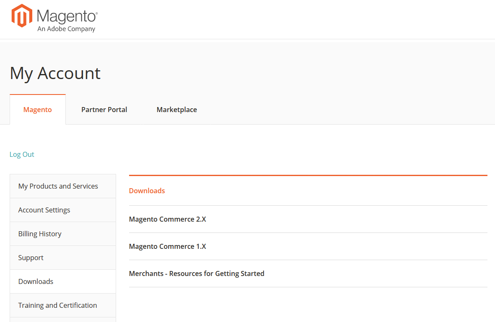

The Adobe Commerce Customer Support Guide explains customer support offerings and how to utilize them. This includes best practices for the support relationship, collecting information needed for diagnosis, customer support priority, submitting a support request, and links to resources. This guide is accessible from the downloads section on your Magento account page. To access:

1. Go to the Magento [account login page.](https://account.magento.com/customer/account/login)
1. Log in with your Magento username and password.
1. In the left navigation bar, click **Downloads**.
1. In the right pane, click **Merchants - Resources for Getting Started**.  
