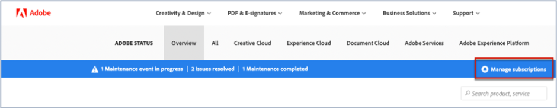
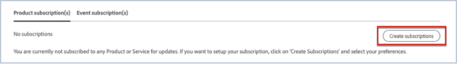
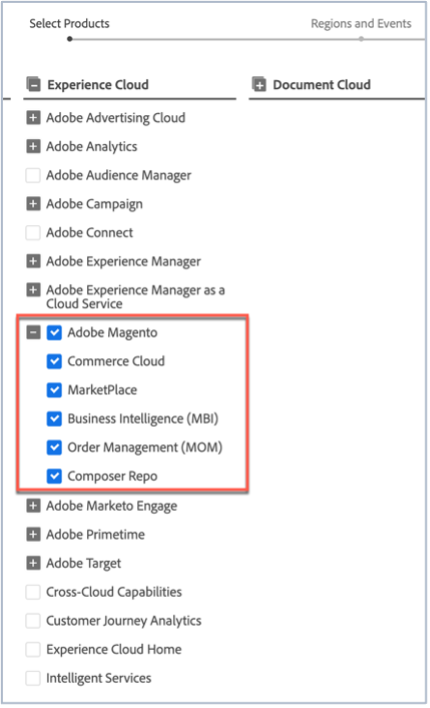
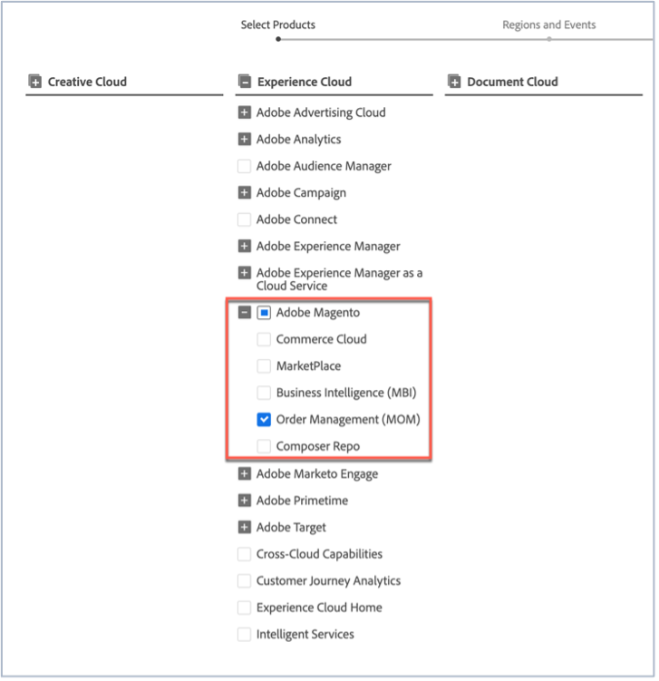
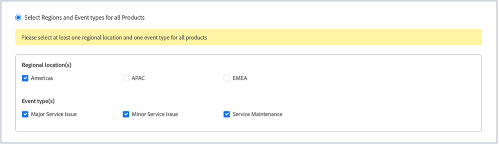
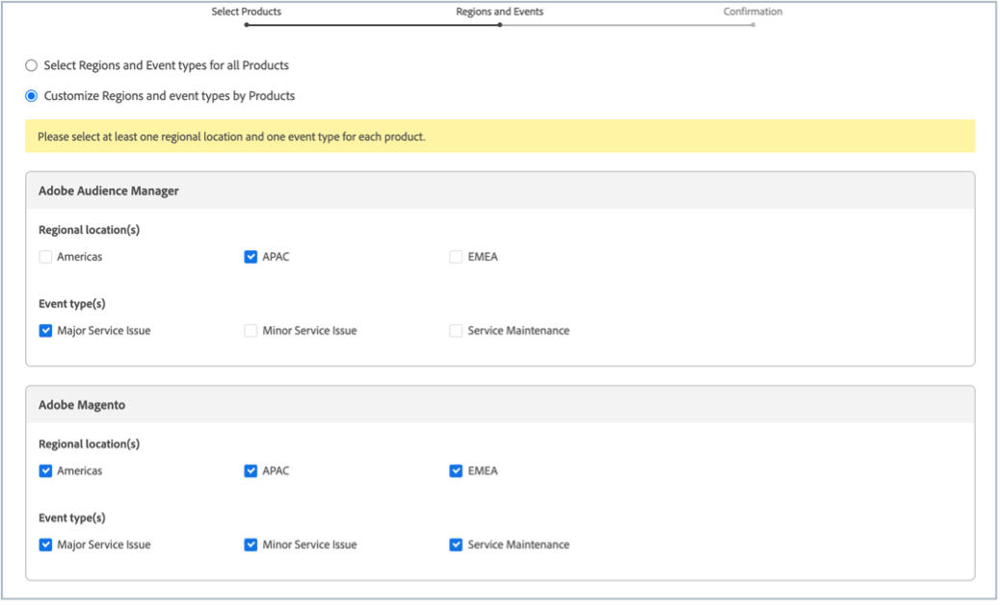
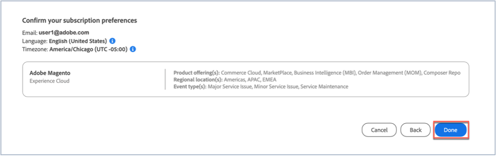

This article explains how you can subscribe to Adobe Commerce status on [Adobe status](https://status.adobe.com) for status alerts, updates, and information concerning any major outages or maintenance.
## How to subscribe to Adobe Magento status updates

1. Go to [Adobe status](https://status.adobe.com).
1. Click **Sign In**.
1. Sign in with your Adobe credentials.
1. Select **Company or School Account** if presented with the option.
1. Click **Manage subscriptions** to the upper right, above the listed Clouds.

    
1. Click **Create subscriptions**.

    
1. You see a window where you can select notifications for products. It may differ from the following screenshot as some subscriptions may be preselected based on your profile or because you have already set up some subscriptions. Click on **Adobe Magento** under Experience Cloud. If you want to receive notifications for all Adobe Magento services check the Adobe Magento checkbox. This will automatically select all Adobe Magento services which you can see when the Adobe Magento section expands (see screenshot).

    

    Alternatively, to select one Adobe Magento service, uncheck the other Adobe Magento services' check boxes. So, for example if you only want to receive notifications for Order Management (MOM) uncheck the other services, so that only the Adobe Magento checkbox and the Order Management (MOM) checkbox are checked (see screenshot).

          
1. You see a window where you can select notifications for products for select regions and events. If you want to receive notifications for the same regions and event types for all products, check the **Select Regions and Event types for all Products** checkbox (see screenshot).

    

    Alternately, if you have subscribed to several products (not just Adobe Magento) and want each product to have notifications for different regions and event types, check the **Customize Regions and event types by Products** checkbox (see screenshot).

    
1. Click **Continue**.
1. The **Confirm your subscription preferences** window displays. Check that the notifications reflect what you want. Click **Done**.

  

After you click **Done** you should see a summary of your product subscriptions and event subscriptions and you will receive an email titled "Subscription to Status email notifications" from Adobe. If you want to unsubscribe and/or change your notification settings repeat steps one – nine.
