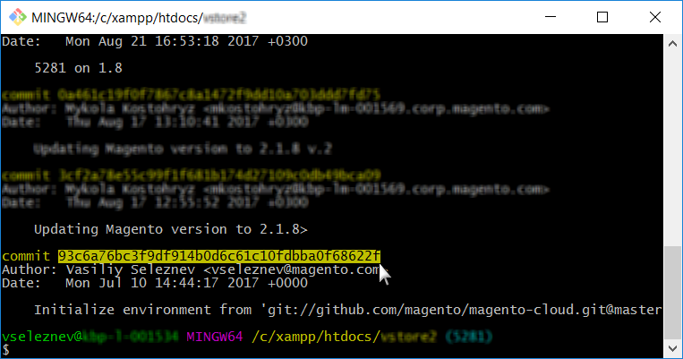

This article shows two solutions to roll back an environment without having a snapshot of your environment on Adobe Commerce on cloud infrastructure.

## Affected products and versions

* Adobe Commerce on cloud infrastructure, [all supported versions](https://magento.com/sites/default/files/magento-software-lifecycle-policy.pdf)

Choose the most appropriate for your case:

* If you have a stable build, but no valid snapshot - [Scenario 1: No snapshot, build stable (SSH connection available)](scen2).
* If the build is broken and you have no valid snapshot - [Scenario 2: No snapshot; build broken (no SSH connection)](scen3).

<h2 id="scen2">Scenario 1: No snapshot, build stable (SSH connection available)</h2>

This section shows how to roll back an environment when you have not created a snapshot but can access the environment via SSH.

The steps are:

1. Disable Configuration Management.
1. Uninstall the Adobe Commerce software.
1. Reset the git branch.

After performing these steps:

* your Adobe Commerce installation returns to its Vanilla state (database restored; deployment configuration removed; directories under `var` cleared)
* your git branch is reset to the desired state in the past

Read the detailed steps below:

<h3 id="disable_config_management">Step 0 (Prerequisite): Remove config.php to disable Configuration Management</h3>

We need to disable Configuration Management so that it does not automatically apply the previous configuration settings during deployment.

To disable Configuration Management, make sure that your `/app/etc/` directory does not contain the `config.php` (for Adobe Commerce 2.2.x) or `config.local.php` (for Adobe Commerce 2.1.x) files.

To remove the configuration file, follow these steps:

1. [SSH to your environment](http://devdocs.magento.com/guides/v2.2/cloud/env/environments-ssh.html#ssh).
1. Remove the configuration file:
    * For Adobe Commerce 2.2:    
    ```php
     rm app/etc/config.php
    ``` 
   
    * For Adobe Commerce 2.1:    
    ```php
      rm app/etc/config.local.php
    ```    

Learn more about Configuration Management by reviewing:

* [Reduce deployment downtime on Adobe Commerce on cloud infrastructure](https://support.magento.com/hc/en-us/articles/115003169574) in our support knowledge base.
* [Configuration management for store settings](http://devdocs.magento.com/guides/v2.2/cloud/live/sens-data-over.html) in our developer documentation.

<h3 id="setup-uninstall">Step 1: Uninstall the Adobe Commerce software with setup:uninstall command</h3>


Uninstalling the Adobe Commerce software drops and restores the database, removes the deployment configuration, and clears directories under `var`.

Review [Uninstall the Adobe Commerce software](http://devdocs.magento.com/guides/v2.2/install-gde/install/cli/install-cli-uninstall.html#instgde-install-uninstall) in our developer documentation.

To uninstall the Adobe Commerce software, follow these steps:

1. [SSH to your environment](http://devdocs.magento.com/guides/v2.2/cloud/env/environments-ssh.html#ssh).
1. Execute `setup:uninstall`:    
    ```php    
      php bin/magento setup:uninstall
    ```    
1. Confirm uninstall.

The following message displays to confirm a successful uninstallation:

```php
[SUCCESS]: Magento uninstallation complete.
```

This means we have reverted our Adobe Commerce installation (including DB) to its authentic (Vanilla) state.

<h3 id="reset-git-branch">Step 2: Reset the git branch</h3>

With git reset, we revert the code to the desired state in the past.

1. Clone the environment to your local development environment. You may copy the command in your Project Web Interface:        
1. Access the commits history. Use `--reverse` to display history in reverse order for more convenience:    
    ```git    
      git log --reverse
      ```    
1. Select the commit hash on which you've been good. To reset code to its authentic state (Vanilla), find the very first commit that created your branch (environment).        
1. Apply hard git reset:    
    ```git    
      git reset --h <commit_hash>    
      ```    
1. Push changes to server:    
    ```git
      git push --force <origin> <branch>
      ```    

After performing these steps, our git branch gets reset and the entire git changelog is clear. The last git push triggers the redeploy to apply all changes and re-install Adobe Commerce.

<h2 id="scen3">Scenario 2: No snapshot; build broken (no SSH connection)</h2>

This section shows how to roll back an environment when it is in a critical state: the deployment procedure cannot succeed in building a working application, thus making the SSH connection unavailable.

In this scenario, you must first restore the working state of your Adobe Commerce application using git reset, then uninstall the Adobe Commerce software (to drop and restore the database, remove the deployment configuration, etc.). The scenario involves the same steps as in Scenario 1, but the order of steps is different and there is an additional step — force redeploy. The steps are:

 [1. Reset the git branch.](https://support.magento.com/hc/en-us/articles/360000852534#reset-git-branch)  [2. Disable Configuration Management.](https://support.magento.com/hc/en-us/articles/360000852534#disable_config_management)  [3. Uninstall the Adobe Commerce software.](https://support.magento.com/hc/en-us/articles/360000852534#setup-uninstall) 4. Force redeploy.

After performing these steps, you will have the same results as in Scenario 1.

### Step 4: Force redeploy

Make a commit (this might be an empty commit, although we do not recommend it) and push it to the server to trigger redeploy:

```git
git commit --allow-empty -m "<message>" && git push <origin> <branch>
```

## If setup:uninstall fails, reset database manually

If executing the `setup:uninstall` command fails with an error and cannot be completed, we may clear the DB manually with these steps:

1. [SSH to your environment](http://devdocs.magento.com/guides/v2.2/cloud/env/environments-ssh.html#ssh).
1. Connect to the MySQL DB:    
    ```sql
    mysql -h database.internal    
    ```    
1. Drop the `main` DB:    
    ```sql
    drop database main;    
    ```    
1. Create an empty `main` DB:    
    ```sql    
    create database main;    
    ```    
1. Delete the following configuration files: `config.php`, `config.php` `.bak`, `env.php`, `env.php.bak`.

After resetting the DB, [make a git push to the environment to trigger redeploy](https://devdocs.magento.com/guides/v2.3/cloud/reference/cli-ref-topic.html#git-commands) and install Adobe Commerce to a newly created DB. Or [run the redeploy command](https://devdocs.magento.com/guides/v2.3/cloud/reference/cli-ref-topic.html#environment-commands).

## Related reading

In our developer documentation:

* [Restore a snapshot on Cloud](https://devdocs.magento.com/guides/v2.2/cloud/project/project-webint-snap.html#restore-snapshot)
* [Create a snapshot](https://devdocs.magento.com/guides/v2.2/cloud/project/project-webint-snap.html#create-snapshot)
* [Snapshots and backup management](https://devdocs.magento.com/guides/v2.3/cloud/project/project-webint-snap.html)
* [Configure your project - View environment history](https://devdocs.magento.com/guides/v2.3/cloud/project/project-webint-basic.html#project-conf-hist)
* [Component deployment failure](https://devdocs.magento.com/guides/v2.3/cloud/trouble/trouble_comp-deploy-fail.html)
* [Manage your project](https://devdocs.magento.com/guides/v2.3/cloud/project/projects.html)
