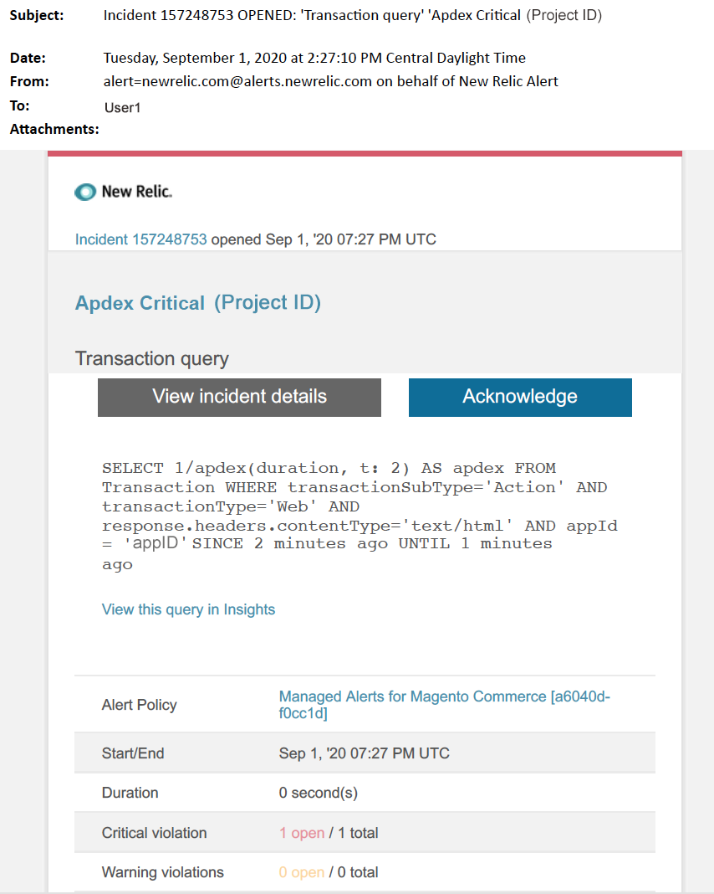

This article provides troubleshooting steps when you receive an Apdex critical alert for Adobe Commerce in New Relic. The Apdex score measures users' satisfaction to the response time of web applications and services. Immediate action is required to remedy the issue. The alert will look something like the following, depending on the alert notification channel you selected.

## Affected products and versions

* Adobe Commerce on cloud infrastructure Pro plan architecture
* Adobe Commerce on cloud infrastructure Starter plan architecture

## Issue

You will receive a managed alert in New Relic if you have signed up to [Managed alerts for Adobe Commerce](https://support.magento.com/hc/en-us/articles/360045806832) and one or more of the alert thresholds have been surpassed. These alerts were developed by Adobe to give merchants a standard set using insights from Support and Engineering.

  **Do!** 

* Abort any deployment scheduled until this alert is cleared.
* Put your site into maintenance mode immediately if your site is or becomes completely unresponsive. For steps, refer to [Installation Guide > Enable or disable maintenance mode](https://devdocs.magento.com/guides/v2.4/install-gde/install/cli/install-cli-subcommands-maint.html?itm_source=devdocs&itm_medium=search_page&itm_campaign=federated_search&itm_term=mainten) in our developer documentation. Make sure to add your IP to the exempt IP address list to ensure that you are still able to access your site for troubleshooting. For steps, refer to [Maintain the list of exempt IP addresses](https://devdocs.magento.com/guides/v2.4/install-gde/install/cli/install-cli-subcommands-maint.html?itm_source=devdocs&itm_medium=search_page&itm_campaign=federated_search&itm_term=mainten#instgde-cli-maint-exempt) in our developer documentation.

 **Don't!**

* Launch additional marketing campaigns which may bring additional pageviews to your site.
* Run indexers or additional crons which may cause additional stress on CPU or disk.
* Do any major administrative tasks (i.e., the Commerce Admin, data imports/exports).
* Clear your cache.

Doing the above when you have received a critical alert, before you have troubleshooted the cause of the alert, may lead to your site becoming non-responsive, if you are not already experiencing a site outage.

## Solution

Follow these steps to identify and troubleshoot the cause.

>![warning]
>
>Because this is a critical alert, it is highly recommended you complete **Step 1** before you try to troubleshoot the issue (Step 2 onwards).

1. Check if an Adobe Commerce support ticket exists. For steps, refer to [Track your support tickets](https://support.magento.com/hc/en-us/articles/360000913794#track-tickets) in our support knowledge base. Support may have received a New Relic threshold alert, created a ticket and started working on the issue. If no ticket exists, create one. The ticket should have the following information:
    * Contact Reason: select “New Relic CRITICAL alert received".
    * Description of the alert.
    * [New Relic Incident link](https://docs.newrelic.com/docs/alerts-applied-intelligence/new-relic-alerts/alert-incidents/view-violation-event-details-incidents). This is included in your [Managed alerts for Adobe Commerce](https://support.magento.com/hc/en-us/articles/360045806832).
1. To identify the source of the problem, use [New Relic APM's Transaction page](https://docs.newrelic.com/docs/apm/applications-menu/monitoring/transactions-page-find-specific-performance-problems) to identify transactions with performance issues:
    * Sort transactions by ascending Apdex scores. [Apdex](https://docs.newrelic.com/docs/apm/new-relic-apm/apdex/apdex-measure-user-satisfaction) refers to user satisfaction to the response time of your web applications and services. A low Apdex score can indicate a bottleneck (a transaction with a higher response time). Usually it is the database, Redis, or PHP. For steps, refer to New Relic [View transactions with highest Apdex dissatisfaction](https://docs.newrelic.com/docs/apm/new-relic-apm/apdex/view-your-apdex-score#apdex-dissat).
    * Sort transactions by highest throughput, the slowest average response time, most time-consuming, and other thresholds. For steps, refer to New Relic [Find specific performance problems](https://docs.newrelic.com/docs/apm/applications-menu/monitoring/transactions-page-find-specific-performance-problems). If you are still struggling to identify the issue use New Relic APM's Infrastructure page.
1. Use [New Relic APM's Infrastructure page](https://docs.newrelic.com/docs/infrastructure/infrastructure-ui-pages/infrastructure-ui/infrastructure-hosts-page) to identify resource intensive processes. For steps, refer to New Relic [Infrastructure monitoring Hosts page > Processes tab](https://docs.newrelic.com/docs/infrastructure/infrastructure-ui-pages/infrastructure-ui/infrastructure-hosts-page#processes-tab).
1. If services like Redis or MySQL are the top source of memory consumption, try the following:
    * Check that you are on the latest version. Newer versions can sometimes fix memory leaks. If you are not on the latest version, consider upgrading. For steps, refer to [Cloud for Adobe Commerce > Services > Change Services](https://devdocs.magento.com/cloud/project/project-conf-files_services.html#change-service-version) in our developer documentation.
    * Check for MySQL issues like long running queries, Primary keys not defined, and duplicate indexes. For steps, refer to [Most Common database Issues in Adobe Commerce on cloud infrastructure](https://support.magento.com/hc/en-us/articles/360041739651) in our developer documentation.
    * Check for PHP issues. Review running processes by running `ps aufx` in the CLI/Terminal. In the terminal output you will see cron jobs and processes that are currently being executed. Check the output for the processes' execution time. If there is a cron with a long execution time, the cron may be hanging. For troubleshooting steps, refer to [Slow performance, slow and long running crons](https://support.magento.com/hc/en-us/articles/360034631192) and [Cron job stuck in "running" status](https://support.magento.com/hc/en-us/articles/360033099451) in our support knowledge base.

1. Once the source is identified, SSH into the environment to investigate further. For steps, refer to [Cloud for Adobe Commerce > Technologies and requirements > SSH into your environment](https://devdocs.magento.com/cloud/env/environments-ssh.html#ssh) in our developer documentation.
1. If you are still struggling to identify the source, review recent trends to identify issues with recent code deployments or configuration changes (for example, new customer groups and large changes to the catalog). It is recommended that you review the past seven days of activity for any correlations in code deployments or changes.
1. If you are unable to find a solution within a reasonable time, request an upsize or place site into maintenance mode if you have not already done so. For steps, refer to [How to request temp resize](https://support.magento.com/hc/en-us/articles/360041138511) in our support knowledge base, and [Installation Guide > Enable or disable maintenance mode](https://devdocs.magento.com/guides/v2.4/install-gde/install/cli/install-cli-subcommands-maint.html?itm_source=devdocs&itm_medium=search_page&itm_campaign=federated_search&itm_term=mainten) in our developer documentation.
1. If the upsize returns the site to normal operations, consider requesting a permanent upsize (contact your CSM), or try to reproduce the problem in your Dedicated Staging by running a load test and optimize queries, or code that reduces pressure on services. Refer to [Cloud for Adobe Commerce > Test Deployment > Load and stress testing](https://devdocs.magento.com/cloud/live/stage-prod-test.html#loadtest) in our developer documentation.
