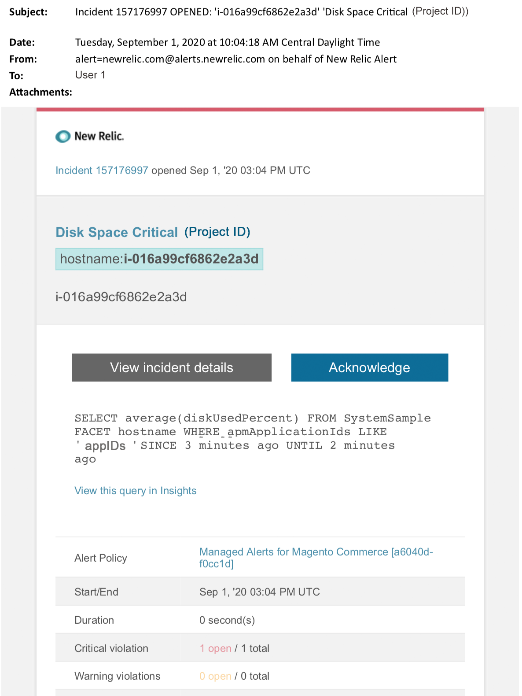

This article provides troubleshooting steps when you receive a critical disk alert for Magento Commerce in New Relic. Immediate action is required to remedy the issue. The alert will look something like the following, depending on the alert notification channel you selected.

## Affected products and versions

Magento Commerce Cloud Pro.

## Issue

You will receive an alert in New Relic if you have signed up to [Managed alerts for Magento Commerce](https://support.magento.com/hc/en-us/articles/360045806832) and one or more of the alert thresholds have been surpassed. These alerts were developed by Magento to give customers a standard set using insights from Support and Engineering.

  **Do!**  

* Abort any deployment scheduled until this alert is cleared.
* Put your site into maintenance mode immediately if your site is or becomes completely unresponsive. For steps refer to DevDocs [Installation Guide> Enable or disable maintenance mode](https://devdocs.magento.com/guides/v2.4/install-gde/install/cli/install-cli-subcommands-maint.html?itm_source=devdocs&itm_medium=search_page&itm_campaign=federated_search&itm_term=mainten) . Make sure to add your IP to the exempt IP address list to ensure that you are still able to access your site for troubleshooting. For steps, refer to DevDocs [Maintain the list of exempt IP addresses](https://devdocs.magento.com/guides/v2.4/install-gde/install/cli/install-cli-subcommands-maint.html?itm_source=devdocs&itm_medium=search_page&itm_campaign=federated_search&itm_term=mainten#instgde-cli-maint-exempt) .

 ** Don't! ** 

* Launch additional marketing campaigns which may bring additional pageviews to your site.
* Run indexers or additional crons which may cause additional stress on CPU or disk.
* Do any major administrative tasks (i.e., Magento Admin, data imports / exports).
* Clear your cache.

Your site may become non-responsive, (if you are not already experiencing a site outage) if you do any of the "Don't" actions before you have investigated and solved the cause of the alert.

## Solution

Follow these steps to identify and troubleshoot the cause.

>![warning]
>
>Because this is a critical alert, it is highly recommended you complete **Step 1** before you try to troubleshoot the issue (Step 2 onwards).

1. Check if a Magento support ticket exists. For steps, refer to KB [Track your support tickets](https://support.magento.com/hc/en-us/articles/360000913794#track-tickets) . Support may have received a New Relic threshold alert, created a ticket and started working on the issue. If no ticket exists, create one. The ticket should have the following information:
    * Contact Reason: select “New Relic CRITICAL alert received.”
    * Description of the alert.
    * [New Relic Incident link](https://docs.newrelic.com/docs/alerts-applied-intelligence/new-relic-alerts/alert-incidents/view-violation-event-details-incidents) . This is included in your [Managed alerts for Magento Commerce](https://support.magento.com/hc/en-us/articles/360045806832) .
1. In New Relic, review disks for highest use. For steps refer to Storage tab on New Relic [Infrastructure monitoring Hosts page:](https://docs.newrelic.com/docs/infrastructure/infrastructure-ui-pages/infrastructure-ui/infrastructure-hosts-page) 
    * If in New Relic you see a slow increase in disk usage, try the following options:
    * Optimizing disk space by adjusting space allocation. For steps, refer to DevDocs [Magento Commerce Cloud > Manage Disk space](https://devdocs.magento.com/cloud/project/manage-disk-space.html) . You may also need to request more disk space (contact your CSM).
    * Clear up disk space for MySQL. Refer to [MySQL disk space is low](https://support.magento.com/hc/en-us/articles/360037591972) for steps.
    * If New Relic shows rapidly increasing disk usage, this could indicate that there is a problem that has caused a file to increase very quickly in a directory. Do the following checks:
1. Check overall disk space to identify the problem by running the following command in the CLI/Terminal:    <pre>df -h</pre>    
1. After you identify a directory with unexpectedly large and increasing disk usage, you need to check the affected file system. The following example shows how to check the file directory `pub/media/` . This is the directory Magento uses for storing logs and big media files. However, you should run this command for any directory that shows unexpected disk usage:    <pre>du -sch ~/pub/media/*</pre>    

If the output from the terminal shows a file in one of these directories rapidly increasing in disk usage and you know that the file's content is not needed, consider removing the file. If you are not comfortable taking this action, [submit a Magento support ticket](https://support.magento.com/hc/en-us/articles/360019088251) .