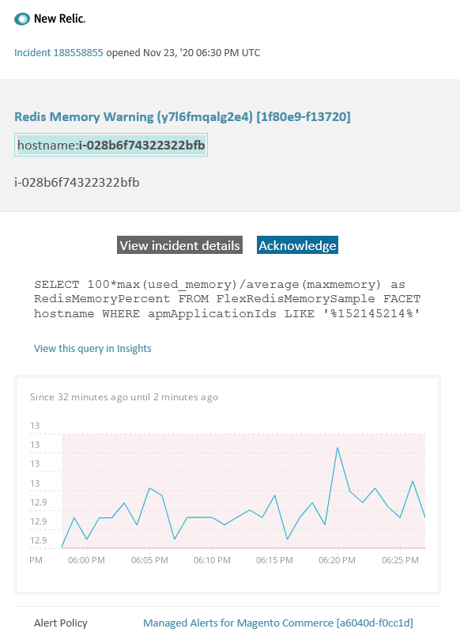

This article provides troubleshooting steps for when you receive a Redis warning alert for Magento Commerce in New Relic. Immediate action is required to resolve the issue. The alert will look something like the following, depending on the alert notification channel you selected:


## Affected products and versions

All versions of Magento Commerce Cloud Pro.

## Issue

You will receive an alert in New Relic if you have signed up to [Managed alerts for Magento Commerce](https://support.magento.com/hc/en-us/articles/360045806832) and one or more of the alert thresholds have been surpassed. These alerts were developed by Magento to give customers a standard set of alerts using insights from Support and Engineering.

 **<u>Do!</u>** 

* It is recommended you abort any deployment scheduled until this alert is cleared.
* Put your site into maintenance mode immediately if your site is or becomes completely unresponsive. For steps refer to [Installation Guide > Enable or disable maintenance mode](https://devdocs.magento.com/guides/v2.4/install-gde/install/cli/install-cli-subcommands-maint.html?itm_source=devdocs&itm_medium=search_page&itm_campaign=federated_search&itm_term=mainten) in Magento Developer documentation.
* Make sure to add your IP to the exempt IP address list to ensure that you are still able to access your site for troubleshooting. For steps, refer to [Maintain the list of exempt IP addresses](https://devdocs.magento.com/guides/v2.4/install-gde/install/cli/install-cli-subcommands-maint.html?itm_source=devdocs&itm_medium=search_page&itm_campaign=federated_search&itm_term=mainten#instgde-cli-maint-exempt) in Magento Developer documentation.

 **<u>Don't!</u>** 

* Launch additional marketing campaigns which may bring additional pageviews to your site.
* Run indexers or additional crons which may cause additional stress on CPU or disk.
* Do any major administrative tasks (i.e., major action in Magento Admin such as data imports / exports, flushing media, saving categories with a great number of assigned products, and mass updates).
* Clear your cache.

## Solution

Follow these steps to identify and troubleshoot the cause.

1. Check if Redis Used Memory is increasing or decreasing by going to [one.newrelic.com](http://one.newrelic.com/) > **Infrastructure** > **Third-party services** page, select the Redis dashboard. If it is stable or increasing, [submit a support ticket](https://support.magento.com/hc/en-us/articles/360019088251) to have your cluster upsized, or increase the `maxmemory` limit to the next level.
1. If you cannot identify the cause of increased Redis memory consumption, review recent trends to identify issues with recent code deployments or configuration changes (for example, new customer groups and large changes to the catalog). It is recommended that you review the past 7 days of activity for any correlations in code deployments or changes.
1. Check for misbehaving third party extensions:
    * Try to find a correlation with recently installed third party extensions and the time the issue started.
    * Review extensions which potentially could affect the Magento cache and cause the cache to grow quickly. For example, custom layout blocks, overriding cache functionality, and storing large amounts of data in cache.
1. If there is no evidence of misbehaving extensions, [Install latest patches to fix Redis issues for Magento Commerce Cloud](https://support.magento.com/hc/en-us/articles/360046678631-Install-latest-patches-to-fix-Redis-issues-for-Magento-Commerce-Cloud) . If the above steps do not help you identify or troubleshoot the source of the issue, consider enabling L2 cache to reduce network traffic between the app and Redis. For general information on what is L2 cache, refer to [L2 caching in the Magento application](https://devdocs.magento.com/guides/v2.4/config-guide/cache/two-level-cache.html) . To enable L2 cache for Cloud, try the following:
1. Upgrade ECE Tools if below 2002.1.2 version.
1. Configure L2 Cache by using [Use REDIS\_BACKEND variable](https://devdocs.magento.com/cloud/env/variables-deploy.html#redis_backend) and updating `.magento.env.yaml` file:
   ```yaml
   stage:
       deploy:
           REDIS_BACKEND: '\Magento\Framework\Cache\Backend\RemoteSynchronizedCache'
   ```    

