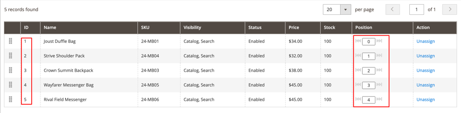
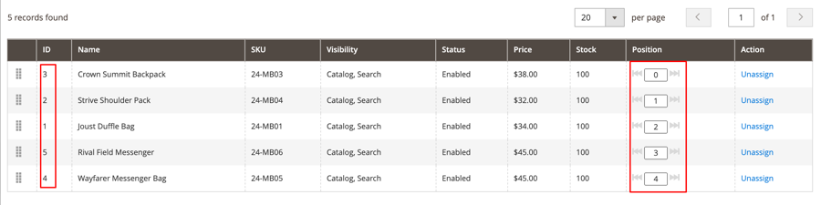
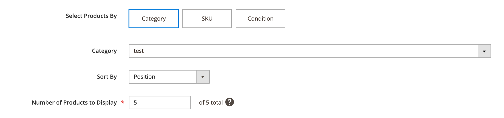

The MDVA-36286 patch solves the issue where the Page Builder products widget preview breaks if the same SKU has a different position in subcategories. This patch is available when the [Magento Quality Patch (MQP) tool](https://devdocs.magento.com/guides/v2.4/comp-mgr/patching.html#mqp) v.1.0.23 is installed. Please note that the issue is scheduled to be fixed in Magento version 2.4.3.

## Affected products and versions

* The patch was designed for Magento Commerce Cloud 2.3.6
* The patch is also compatible with Magento Commerce and Magento Commerce Cloud 2.3.6 - 2.4.2-p1

>![info]
>
>Note: the patch might become applicable to other versions with new MQP tool releases. To check if the patch is compatible with your Magento version, run `./vendor/bin/magento-patches status`.

## Issue

<ins>Steps to reproduce:</ins>

1. Create a category with a few products.
          
1. Create a sub-category with the same products, but with different positions.
        .
1. Edit a CMS page content to add a Product widget via Page Builder. (Select the parent category above).
        .
1. Save and wait for the content preview.

<ins>Expected results:</ins>

Content preview displays the product widget.

<ins>Actual results:</ins>

Error displays:

*We're sorry, an error has occurred while generating this content.*

## Apply the patch

To apply individual patches use the following links depending on your Magento product:

* Magento Commerce: DevDocs [Software Update Guide > Apply Patches](https://devdocs.magento.com/guides/v2.4/comp-mgr/patching/mqp.html).
* Magento Commerce Cloud: DevDocs [Upgrades and Patches > Apply Patches](https://devdocs.magento.com/cloud/project/project-patch.html).

## Related reading

To learn more about Magento Quality Patches, refer to:

* [Magento Quality Patches released: a new tool to self-serve quality patches](https://support.magento.com/hc/en-us/articles/360047139492).
* [Check if patch is available for your Magento issue using Magento Quality Patches](https://support.magento.com/hc/en-us/articles/360047125252).

For info about other patches available in MQP tool, refer to the [Patches available in MQP tool](https://support.magento.com/hc/en-us/sections/360010506631-Patches-available-in-MQP-tool-) section.
