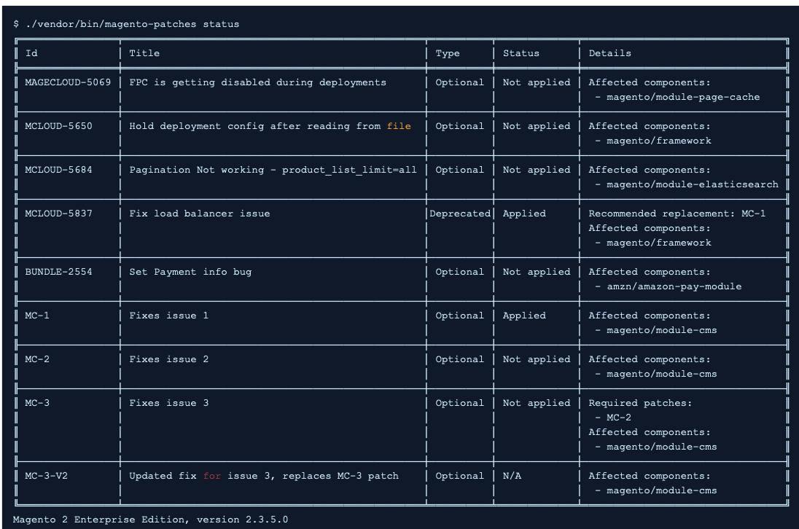

This article provides an overview of Quality Patches Tool (QPT) and links to resources explaining how to use it.

## Affected products and versions

* Adobe Commerce on-premises, all [supported versions](https://magento.com/sites/default/files/magento-software-lifecycle-policy.pdf)  
* Adobe Commerce on cloud infrastructure, all [supported versions](https://magento.com/sites/default/files/magento-software-lifecycle-policy.pdf)

## What are Quality Patches Tool

The [Quality Patches Tool](https://github.com/magento/quality-patches) (QPT) are individual patches developed by Adobe and the Magento Open Source community.

It allows you to:

* apply quality patches included to the package
* revert previously applied patches
* view the general information about quality patches available for the installed version of Adobe Commerce.

Here's an example of the status table you can get to view the available patches:

The tool is aimed to enable you to self-serve with patches for issues you might experience with Adobe Commerce, or easily apply patches suggested by Adobe Commerce support.

>![info]
>
>Note: QPT is for quality patches only. Security patches are available in the [Magento Security Center](https://magento.com/security/patches).

## Patches available in Quality Patches Tool
Please refer to [Quality Patches Tool](https://devdocs.magento.com/quality-patches/tool.html#patch-grid) in our developer documentation for the list of available patches.

## How to install and use Quality Patches Tool

The installation and usage commands are different for Adobe Commerce on-premises and Adobe Commerce on cloud infrastructure, because for cloud the QPT package is included to the ece-tools package.

### How to install and use QPT for Adobe Commerce on-premises

Please refer to [Software Update Guide > Patching](https://devdocs.magento.com/guides/v2.4/comp-mgr/patching/mqp.html) in our developer documentation for details on how to install and use QPT for applying and reverting patches.

### How to install and use QPT for Adobe Commerce on cloud infrastructure

Please refer to [ Cloud for Adobe Commerce > Apply patches](https://devdocs.magento.com/cloud/project/project-patch.html) in our developer documentation for details on how to install and use QPT for applying and reverting patches on Adobe Commerce on cloud infrastructure.

## Related reading

* [Quality Patches Tool release notes](https://devdocs.magento.com/quality-patches/release-notes.html) in our developer documentation.
* [How to apply composer patches provided by Adobe](https://support.magento.com/hc/en-us/articles/360028367731) in our support knowledge base.
