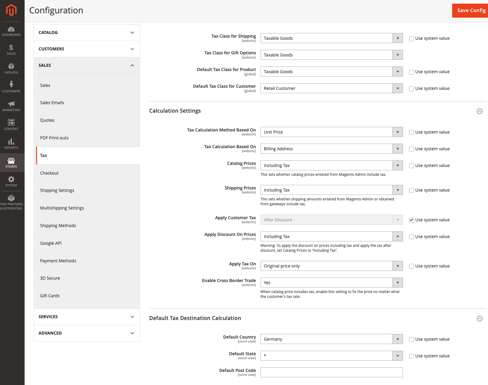

The MDVA-42520 patch fixes the issue where the tax rate is applied twice when the **Enable Cross Border Trade** is used. This patch is available when the [Quality Patches Tool (QPT)](https://support.magento.com/hc/en-us/articles/360047139492) 1.1.11 is installed. The patch ID is MDVA-42520. Please note that the issue is scheduled to be fixed in Adobe Commerce 2.4.5.

## Affected products and versions

**The patch is created for Adobe Commerce version:**

* Adobe Commerce (all deployment methods) 2.4.3-p1

**Compatible with Adobe Commerce versions:**

* Adobe Commerce (all deployment methods) 2.4.3 - 2.4.3-p1

>![info]
>
>Note: the patch might become applicable to other versions with new Quality Patches Tool releases. To check if the patch is compatible with your Adobe Commerce version, update the `magento/quality-patches` package to the latest version and check the compatibility on the [QPT landing page](https://devdocs.magento.com/quality-patches/tool.html#patch-grid). Use the patch ID as a search keyword to locate the patch.

## Issue

The tax rate is applied twice when the **Enable Cross Border Trade** is used.

<ins>Steps to reproduce</ins>:

1. Enable **Company**, **Shared Catalog**, and **Quote**
1. Configure taxes according to the screenshot. Make sure you enable **Cross Border Trade**.

    
1. Create a tax rate for Germany (10%).
1. Create a tax rule to apply the tax rate.
1. Create a company and a custom shared catalog.
1. Create a product with a price of 100 and include it in the custom shared catalog with a price discount of 20%.
1. Create a customer with a German address and assign it to the company
1. Add 10 products to the card as the customer.
1. Go to the shopping cart and request a quote.
1. Open this quote on the backend and try to add an additional 10% discount.

<ins>Expected results</ins>:

Quote Subtotal (Including Tax) and Quote Grand Total (Including Tax) = $720

<ins>Actual results</ins>:

Quote Subtotal (Including Tax) and Quote Grand Total (Including Tax) = $649.50.

## Apply the patch

To apply individual patches, use the following links depending on your deployment method:

* Adobe Commerce or Magento Open Source on-premises: [Software Update Guide > Apply Patches](https://devdocs.magento.com/guides/v2.4/comp-mgr/patching/mqp.html) in our developer documentation.
* Adobe Commerce on cloud infrastructure: [Upgrades and Patches > Apply Patches](https://devdocs.magento.com/cloud/project/project-patch.html) in our developer documentation.

## Related reading

To learn more about Quality Patches Tool, refer to:

* [Quality Patches Tool released: a new tool to self-serve quality patches](https://support.magento.com/hc/en-us/articles/360047139492) in our support knowledge base.
* [Check if patch is available for your Adobe Commerce issue using Quality Patches Tool](https://support.magento.com/hc/en-us/articles/360047125252) in our support knowledge base.

For info about other patches available in QPT, refer to [Patches available in QPT](https://devdocs.magento.com/quality-patches/tool.html#patch-grid) in our developer documentation.
