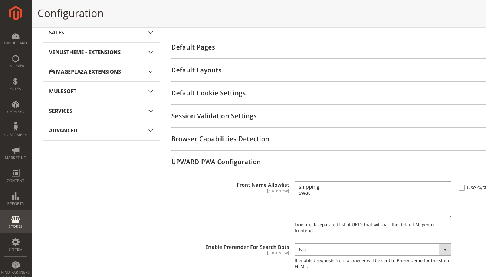

This article provides a solution for when you receive 403 errors when trying to access the Site-Wide Analysis Tool on Adobe Commerce.

## Affected products and versions

Adobe Commerce on cloud infrastructure 2.4.1 and later.

## Issue

You get a 403 error when trying to access the Site-Wide Analysis Tool.

 <ins>Steps to reproduce:</ins>

Log in to the Commerce Admin panel and click **Reports** > *System Insights* > **Site-Wide Analysis Tool**.

 <ins>Expected result:</ins>

You see the Site-Wide Analysis Tool.

<ins>Actual result:</ins>

You see: *Error 403.*


## Solution

To make sure that the Site-Wide Analysis Tool has the proper access to your application, run the following command in the CLI. Replace <store URL> with your store URL:

```cURL
curl -sIL -X GET <store URL>/swat/key/index | grep HTTP
HTTP/2 403
```
Take steps depending on the response code you get.

#### 403 Forbidden response code

If the response code is 403, you may have Cloudflare bot protection which is blocking Site-Wide Analysis Tool. To access the tool, whitelist its IP's:

* 107.23.33.174
* 3.225.9.244
* 3.88.83.85

#### Correct 200 response code and JSON output

If the response is the correct 200 code and JSON output, [submit a support ticket](https://support.magento.com/hc/en-us/articles/360019088251-Submit-a-support-ticket) to escalate the issue with Site-Wide Analysis Tool access.


#### 500 (Fatal error) response code

If a response code is 500 (Fatal error), please install the MDVA-38526 patch. Use one of the following links to download the patch, depending on the type of patch you want:

* Adobe Commerce on cloud infrastructure patch: [MDVA-38526_EE_2.4.1-p1_v3.patch.zip](assets/MDVA-38526_EE_2.4.1-p1_v3.patch)
* Adobe Commerce on cloud infrastructure composer patch: [MDVA-38526_EE_2.4.1-p1_COMPOSER_v3.patch.zip](assets/MDVA-38526_EE_2.4.1-p1_COMPOSER_v3.patch.zip)

The patch is applicable for Adobe Commerce on cloud infrastructure versions 2.4.1 and later.

#### Response not JSON

If the response output is not JSON, it could be because of PWA/Headless implementation. If you are using Headless implementation, update the UPWARD configuration to bypass requests to Adobe Commerce Origin. To do this, in the Adobe Commerce Admin, under **Stores** > **Configuration** > **General** > **Web** > **UPWARD PWA Configuration** > **Front Name Allowlist**, add *swat*.



If you are still not able to access the Site-Wide Analysis Tool, when you log in next time in to the Commerce Admin panel and navigate to **Reports** > *System Insights* > **Site-Wide Analysis Tool**, [submit a support ticket](https://support.magento.com/hc/en-us/articles/360019088251-Submit-a-support-ticket).

## Related reading

* [Adobe Commerce Site-Wide Analysis Tool report, an introduction video](https://support.magento.com/hc/en-us/articles/360048980691-Magento-Site-Wide-Analysis-Tool-report-an-introduction-video) in our support knowledge base (you need to be logged in to view the article).
* [Adobe Commerce Site-Wide Analysis Tool Report FAQ](https://support.magento.com/hc/en-us/articles/360048646671-Magento-Site-Wide-Analysis-Tool-Report-FAQ) in our support knowledge base.
