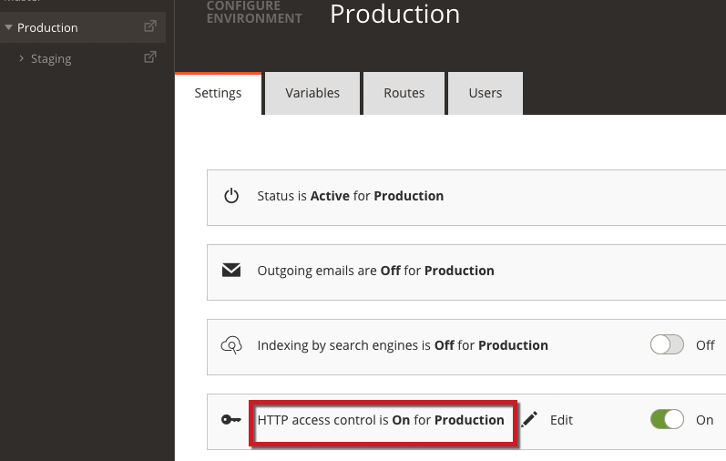
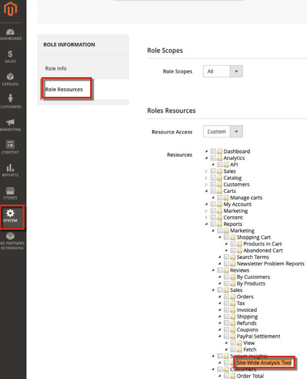

This article provides a solution for when you receive 403 errors when trying to access the Site-Wide Analysis Tool on Adobe Commerce.

## Affected products and versions

Adobe Commerce on cloud infrastructure 2.4.1+

## Issue

You get a 403 error when trying to access the Site-Wide Analysis Tool.

 Steps to reproduce:

Log in to the Commerce Admin panel and click **Reports** > *System Insights* > **Site-Wide Analysis Tool**.

 Expected result:

You see the Site-Wide Analysis Tool.

Actual result:

You see: *Error 403.*

## Cause

There are two potential causes:

* You may have HTTP access control enabled. The Site-Wide Analysis Tool Dashboard does NOT support customers if they have HTTP Auth enabled.
* Your Commerce administrator account may not have been assigned to the *Site-Wide Analysis Tool* Resource.

## Solution

Check if you have HTTP access control enabled:

1. Go to your Cloud Project URL and select your production or staging environment.
1. Ensure HTTP access control is not enabled (see screen shot).   

If when you next try to access the Site-Wide Analysis Tool, there is still a 403 error, you may not have added the *Site-Wide Analysis Tool* role also known as *Super Admin* to your Admin profile. The *Site-Wide Analysis Tool* role is not assigned by default. It must be added manually, by the Customer Account Owner/Admin to each Customer Admin that wants access to the Site-Wide Analysis Tool:

<ol><li>Go to <strong>System</strong> > Permissions > <strong>User Roles</strong>. In the upper-right corner, click <strong>Add New Role</strong>.
</li><li>On the <strong>Role Info</strong> tab under ROLE INFORMATION, enter a descriptive role name and under Current User Identity Verification, enter your password.
</li><li>On the <strong>Role Resources</strong> tab under ROLE INFORMATION setRole Scopes to <em>All</em> or <em>Custom</em>.</li>
<li>Under <em>Roles Resources</em>, set <strong>Resource Access</strong> to <em>Custom</em>.</li>
<li>In the tree, select the checkbox next to Site-Wide Analysis Tool, and click <strong>Save Role</strong>.

</li></ol>

You should be able to access the Site-Wide Analysis Tool when you log in next time in to the Commerce Admin panel and navigate to **Reports** > *System Insights* > **Site-Wide Analysis Tool**. If you still get the 403 error, [submit a support ticket](https://support.magento.com/hc/en-us/articles/360019088251-Submit-a-support-ticket).

## Related Reading

Articles in the Related reading section are visible for signed in users only.

* [Adobe Commerce Site-Wide Analysis Tool report explained in details video](https://support.magento.com/hc/en-us/articles/360048981531-Magento-Site-Wide-Analysis-Tool-report-explained-in-details-video)
* [Adobe Commerce Site-Wide Analysis Tool report, an overview video](https://support.magento.com/hc/en-us/articles/360048980791-Magento-Site-Wide-Analysis-Tool-report-an-overview-video)
* [Adobe Commerce Site-Wide Analysis Tool report, an introduction video](https://support.magento.com/hc/en-us/articles/360048980691-Magento-Site-Wide-Analysis-Tool-report-an-introduction-video)
* [Adobe Commerce Site-Wide Analysis Tool Report FAQ](https://support.magento.com/hc/en-us/articles/360048646671-Magento-Site-Wide-Analysis-Tool-Report-FAQ)
