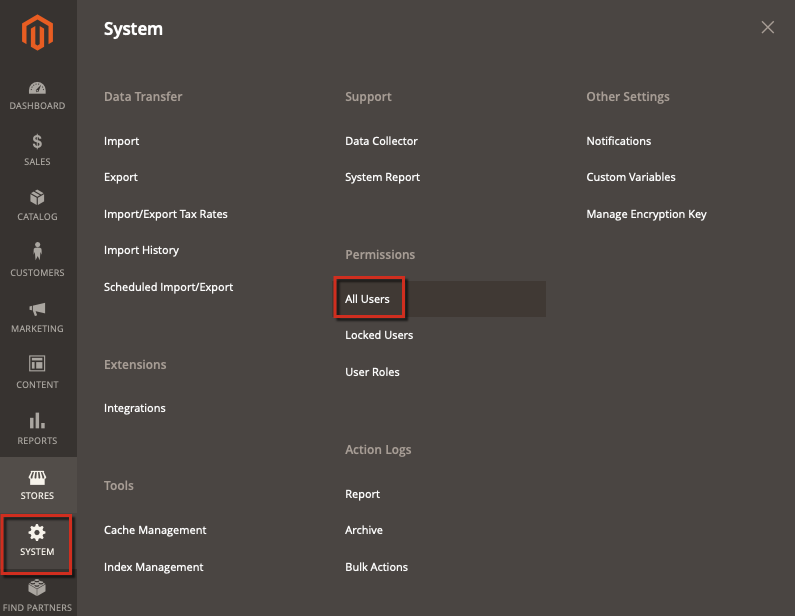

This article provides a fix for when a Commerce Administrator creates a new user with the Administrator privileges and the password is saved as plain text in the `magento_logging_event_changes` database table.

To fix this security issue, install the Adobe Commerce 2.0.16 and 2.1.9 Security Update. After applying the Security Update, the passwords are encrypted and do not appear as plain text.

<h2 id="Adminpasswordsaresavedasplaintexttoactionslog('magento_logging_event_changes'table)-Affectedversions">Affected versions</h2>

* Adobe Commerce on-premises 2.X.X
* Adobe Commerce on cloud infrastructure 2.X.X

<h2 id="Adminpasswordsaresavedasplaintexttoactionslog('magento_logging_event_changes'table)-Issue">Issue</h2>

When an existing Commerce Administrator creates a new user with the Administrator privileges via **System** > **Permissions** > **All Users** > **Add new user**, the password (entered as a confirmation) is saved as plain text in the `magento_logging_event_changes` database table.

<h3 id="Adminpasswordsaresavedasplaintexttoactionslog('magento_logging_event_changes'table)-Stepstoreproduce">Steps to reproduce:</h3>

1. Log in as the Administrator and create a new user by navigating to this path: **System** > Permissions > **All Users**.

    

1. Then click the **Add new user** page. Provide your current Administrator's password when prompted.
1. Go to the **System** > **Action Log** > **Report** page and find the last log entry.
1. You can see the current password, neither encrypted nor hashed.

<h2 id="Adminpasswordsaresavedasplaintexttoactionslog('magento_logging_event_changes'table)-Solution">Solution</h2>

Installing the [Adobe Commerce 2.0.16 and 2.1.9 Security Update](https://magento.com/security/patches/magento-2016-and-219-security-update) fixes this issue.

After installing the Security Update, the password gets encrypted and does not show up in plain text in the `magento_logging_event_changes` table.

<h2 id="Adminpasswordsaresavedasplaintexttoactionslog('magento_logging_event_changes'table)-Moreinformation">More information</h2>

[Adobe Commerce 2.0.16 and 2.1.9 Security Update page](https://magento.com/security/patches/magento-2016-and-219-security-update) in our security center.

[Upgrade the Adobe Commerce application and components](http://devdocs.magento.com/guides/v2.1/comp-mgr/bk-compman-upgrade-guide.html) in our developer documentation.
