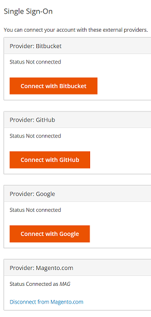
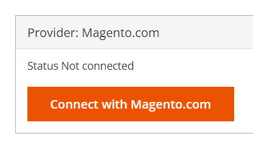

This article provides a fix for the issue when you are unable to access the correct cloud Adobe Commerce project.

## Issue

When you log in to your cloud account at https://accounts.magento.cloud/user, the account is automatically switched to another user's account which prevents you from accessing the correct project.

## Affected products and versions

* Adobe Commerce on cloud infrastructure, all supported versions

## Cause

This issue typically occurs when you are being signed on using the previous account owner's single sign-on integration with magento.com after:

* The Cloud Project ownership had been transferred to you (the user). Because of this you would still be seeing the original project owner's account.

OR

* You (the user) had moved to a different company, accompanied by a change in the email address and the projects that they have access to. Because of this you would still be seeing the projects that you had been granted to in your previous role/company.

## Solution

To reslove the issue, you need to disconnect the single sign-on integration with magento.com. Follow the steps below to disconnect:

1. From https://accounts.magento.cloud/user, expand the **Single Sign-On** section.

    

1. Click **Disconnect from Magento.com** to disconnect.

    

1. Log out.
1. Now click on the **Magento.com** button.

    

1. You should now be able to see the correct account and access the correct cloud project.
