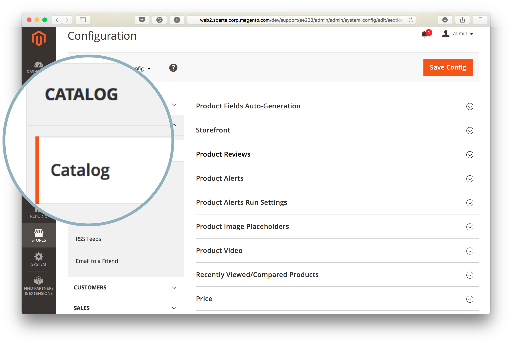
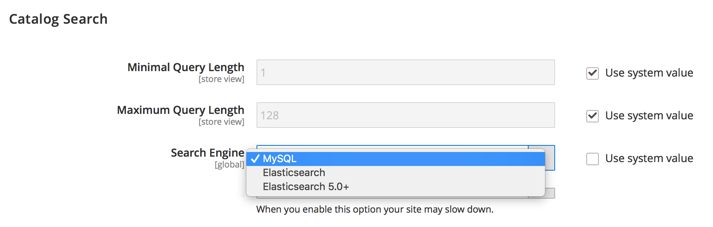

>![warning]
>
> [MySQL catalog search engine will be removed in Adobe Commerce 2.4.0](https://support.magento.com/hc/en-us/articles/360043144271-MySQL-catalog-search-engine-will-be-removed-in-all-versions-of-Magento-2-4-0). You must have Elasticsearch host setup and configured prior to installing version 2.4.0. Refer to [Install and configure Elasticsearch](https://devdocs.magento.com/guides/v2.3/config-guide/elasticsearch/es-overview.html).

This article provides a solution for changing the Adobe Commerce Search Engine using the Commerce Admin if the **Search Engine** field is not displayed or the **Use system value** checkbox is greyed out and not accessible.

In this article:

* [Affected versions](#affected-versions)
* [Change Search Engine using Commerce Admin (steps)](#change-search-engine-using-magento-admin-steps)
* [Issues with Adobe Commerce on-premises)](#magento-commerce-on-premise)
* [Adobe Commerce on cloud infrastructure](#magento-commerce-cloud)

## Affected versions

* Adobe Commerce on-premises: 2.X.X
* Adobe Commerce on cloud infrastructure:
    * Version: 2.X.X
    * Starter and Pro plan architecture
* MySQL, Elasticsearch: all supported versions

## Change Search Engine using the Admin (steps)

1. Log in to the Admin as an Administrator.
1. On the left-side Admin sidebar, click **Stores**. Then, under **Settings**, choose **Configuration**.
1. In the panel on the left under **Catalog,** choose **Catalog**.
1. Expand the **Catalog Search** section.        
1. Go to the **Search Engine** field and remove selection from the **Use system value** checkbox.
1. Click the **Search Engine** menu and select one of the available options.        
1. Click **Save Config** in the top-right corner of the page.

## Issues with Adobe Commerce on-premises

### Issue 1: Search Engine field is not displayed

When you access the **Catalog Search** section, the **Search Engine** menu is not displayed at all.


### Cause: Store View is not Default Config

The Store View for the Admin has been set to any value other than *Default Config*.

The search engine is a global configuration set on the application level, not on the Store Scope. Stores within an Adobe Commerce application cannot use different search engines.

### Solution: Set Store View to Default Config

1. Log in to the Admin as an Administrator.
1. On the left-side Admin sidebar, click **Stores**. Then, under **Settings**, choose **Configuration**.
1. In the upper-left corner, click the **Store View** selector and choose *Default Config*.
1. Click **OK** in the confirmation dialog to approve store view change.


 **Related documentation:** [Changing Scope](http://docs.magento.com/m2/ee/user_guide/configuration/scope-change.html) in our user guide.

### Issue 2: Cannot uncheck "Use system value"

When you access the **Catalog Search** section of the Admin, the **Use system value** checkbox is greyed out so you cannot remove selection from the checkbox to later change the search engine.

### Cause

The default search engine has been configured on the application configuration level in the `app/etc/env.php` or `app/etc/config.php` files and thus cannot be changed using the Admin.

Example of the section with default search engine configuration:

```php
'system'=>
array (
'default'=>
array (
'catalog'=>
array (
'search'=>
array (
'engine'=>'mysql',
),
),
),
),
```

### Solution

Remove the section with default search engine configuration from the `app/etc/env.php` or the `app/etc/config.php` configuration files.

### Related articles in our developer documentation

 [Adobe Commerce configuration files](https://devdocs.magento.com/guides/v2.2/config-guide/config/config-magento.html) in Adobe Commerce Configuration Guide

## Adobe Commerce on cloud infrastructure

Switching search engines using the Admin is not available in Adobe Commerce on cloud infrastructure due to the way the cloud infrastructure has been organized.

During the deployment process, the Adobe Commerce on cloud infrastructure deployment scripts check if Elasticsearch has been declared in the `MAGENTO_CLOUD_RELATIONSHIPS` variable. If declared, Elasticsearch is selected as the active search engine and configured automatically; the [MySQL search engine](https://support.magento.com/hc/en-us/articles/360043144271-MySQL-catalog-search-engine-will-be-removed-in-Magento-2-4-0) becomes inaccessible in the Admin. If the Elasticsearch relationship has not been declared, MySQL is set to active, and Elasticsearch becomes inaccessible.

It is not recommended to edit the `app/etc/env.php` or the `app/etc/config.php` configuration files directly on your cloud environment; that is why changing these files to make the Elasticsearch engine to be displayed in the Admin (the solution we recommend in the previous section) is not applicable for your cloud project.

### Change search engine on Staging and Production environments

Before switching search engine from MySQL to Elasticsearch on your Staging and Production environments, make sure you have previously [submitted a support ticket](https://support.magento.com/hc/en-us/articles/360019088251) requesting to enable Elasticsearch on the environment and the ticket has been resolved successfully.

To change the search engine used on your Staging and Production environments, change the `SEARCH_CONFIGURATION` environment variable in your `.magento.env.yaml` file on your local environment, then push changes to the Integration and Staging/Production environments for the changes to take effect.

If you switch from MySQL to Elasticsearch, the SEARCH\_CONFIGURATION variable in the resulting `.magento.env.yaml` file might look as follows:

```yaml
stage:
  deploy:
   SEARCH_CONFIGURATION:
     engine: elasticsearch
     elasticsearch_server_hostname: hostname
     elasticsearch_server_port: '123456'
     elasticsearch_index_prefix: magento
     elasticsearch_server_timeout: '15'
```

### Related documentation

#### Support Knowledge Base

* [Enable Elasticsearch on Cloud](https://support.magento.com/hc/en-us/articles/115004905874)

#### Developer Documentation

* [Set up Elasticsearch service](http://devdocs.magento.com/guides/v2.2/cloud/project/project-conf-files_services-elastic.html)
* [Build and deploy](http://devdocs.magento.com/guides/v2.2/cloud/project/magento-env-yaml.html) (documentation about the `.magento.env.yaml` configuration file)
* [Deploy variables](https://devdocs.magento.com/guides/v2.2/cloud/env/variables-deploy.html) ( [SEARCH\_CONFIGURATION section](https://devdocs.magento.com/guides/v2.2/cloud/env/variables-deploy.html#searchconfiguration) )
* [Services](http://devdocs.magento.com/guides/v2.2/cloud/project/project-conf-files_services.html) (documentation about the `.magento/services.yaml` configuration file)
