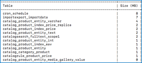

This article provides a solution for Adobe Commerce 2.4.0 known issue when an admin user creates an order for a customer and the refresh buttons on the Customer's Activities side panel do not work.

## Affected products and versions

* Adobe Commerce on-premises 2.4.0
* Adobe Commerce on cloud infrastructure 2.4.0

## Issue

<ins>Steps to reproduce</ins>:

1. Go to the **Admin Panel** > **Sales** > **Orders**.
1. Click the **Create New Order** button.
1. Select the created customer.
1. Go to the storefront as the created customer.
1. Go to the **Product** page. Click the **Refresh** button on the **Recently Viewed Products** section of **Customer's Activities**.
1. Go back to the storefront.
1. Place an order using the created products.
1. Go back to the **Admin Panel** and click the **Refresh** button of the **Last Ordered Items** section of **Customer's Activities**.
1. Go back to the storefront. Add the created product to the **Comparison List**.
1. Go back to the **Admin Panel**. Click the **Refresh** button of the **Products in Comparison List** section of **Customer's Activities**.
1. Go back to the storefront.
1. Remove the created product from the **Comparison List**.
1. Go back to the **Admin Panel**.
1. Click the **Refresh** button of the **Recently Compared Products** section of **Customer's Activities**.
1. Go back to the storefront.

<ins>Expected results</ins>:

 The name of the product should appear in the **Recently Viewed Products**, **Last Ordered Items**, **Products in Comparison List**, and **Recently Compared Products** section.

 <ins>Actual results</ins>:

 The page is scrolled up every time a **Refresh** button is clicked. The name of the product does not appear in the proper section.

## Solution

A workaround is the Admin user can update **Customer's Activities** by clicking the **Update Changes** button at the bottom of the sidebar. The issue is planned to be resolved in the Adobe Commerce 2.4.1 patch.

## Related reading

* [Adobe Commerce 2.4.0 known issue: Braintree payment methods do not show up in Multiple Addresses checkout](https://support.magento.com/hc/en-us/articles/360046354992)
* [Shipping labels creation known issue in Adobe Commerce 2.4.0](https://support.magento.com/hc/en-us/articles/360046750171-Shipping-labels-creation-known-issue-in-Magento-2-4-0)
* [Adobe Commerce 2.4.0 known issue: raw message data display on storefront](https://support.magento.com/hc/en-us/articles/360045804332)
* [Adobe Commerce 2.4.0 known issue: Export Tax Rates does not work](https://support.magento.com/hc/en-us/articles/360045850032)
* [Adobe Commerce 2.4.0 known issue: “Add selections to my cart” button does not work](https://support.magento.com/hc/en-us/articles/360045838312-Magento-2-4-0-known-issue-Add-selections-to-my-cart-button-does-not-work)
