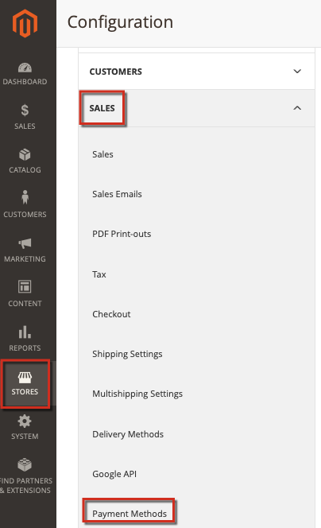

This article provides solutions for issues with processing payments via PayPal, especially the PayFlow Pro solution. Some recommendations in this article may seem obvious. We ask you to attempt the troubleshooting options listed in this knowledge base and include all information in any tickets you enter. Adobe Commerce or PayPal Support Engineers will ask you to perform these steps when diagnosing your issues.

## Common Issues

Most issues with PayPal payments have similar symptoms: after specifying the payment card details and proceeding to checkout, the payment is not being processed. Instead, there might be an error message, failure to process payment, or even a blank page.

## Verify your credentials, crypt keys, and licenses

Possible problems: misprints in account details (usernames, passwords), invalid accounts, expired or non-specified licenses, invalid public and personal keys, and many other aspects. To find those problems, you might also need to check your payment configuration settings.

## Apply consistent settings in Adobe Commerce and PayPal

Make sure you have applied the same settings and have enabled the same functionalities in both the Commerce Admin and PayPal account settings.

### Example settings issue

When applying the PayPal Express Checkout solution, transactions based on AVS/CSC responses must be declined in **PayPal Manager** (Service Settings > Set Up > Security Options) and in **Commerce Admin** ( **Stores** > Configuration > **Sales** > **Payment methods** ...).

For more info, see the documentation: [PayPal](https://www.paypalobjects.com/en_US/vhelp/paypalmanager_help/setup.htm) and [Adobe Commerce](http://docs.magento.com/m2/ee/user_guide/payment/paypal-express-checkout.html) in our user guide.

## Allow reference transactions

If your PayPal payment method involves API with [Billing Agreements and Reference Transactions](https://developer.paypal.com/docs/classic/express-checkout/integration-guide/ECReferenceTxns/), make sure these are enabled and configured correctly in your settings.

### Additional troubleshooting

See the following articles:

* [PayPal gateway rejected request - duplicate invoice issue](https://support.magento.com/hc/en-us/articles/115002457473) in our support knowledge base.
* [Change increment ID for new store entity](https://support.magento.com/hc/en-us/articles/360004002914) in our support knowledge base.

## Contact Support to collect advanced payment logs

To troubleshoot complicated payment issues, the Adobe Commerce Support Team may ask you to apply a dedicated patch to enable advanced payment logging. In this case, your steps should be the following:

 [Submit a support ticket](https://support.magento.com/hc/en-us/articles/360019088251) with the following details:

* Specify your issue with as many details as possible.
* List the steps you attempted from this article, knowledge base, and other resources. Include all results.
* Request an Advanced Payment Logging patch (reference number MDVA-4352) and instructions on applying the patch.

If you receive the Advanced Payment Logging patch:

* Apply the patch.
* Collect logs and attach them to your [support ticket](https://support.magento.com/hc/en-us/articles/360019088251-Submit-a-support-ticket).
* Wait for further recommendations from the Adobe Commerce Support Team.
