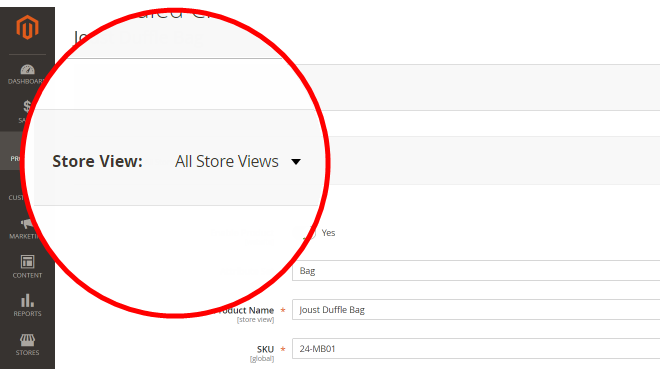
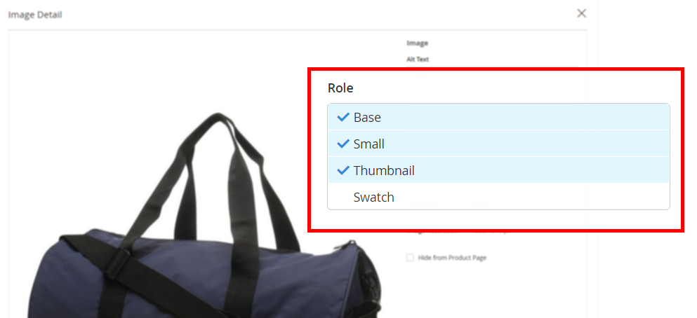
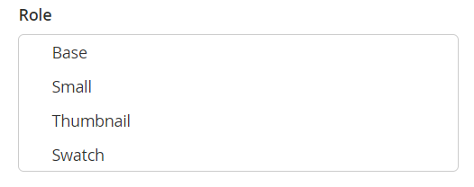

This article provides a fix for when product images do not display on your storefront, despite image roles set on the Product Edit page.

 **Cause:** on Adobe Commerce instances with more than one store, some product images may have the `no_selection` values for image role attributes `image`, `small_image`, `thumbnail`, `swatch`. Such `no_selection` values emerge when the product image role is set on the global, all-stores scope instead of a particular store's scope (in other words, on the **All Store Views** instead of a particular **Store View**). To understand if that's your case, run the SQL script from the **Cause** section below.

 **Solution:** delete rows with the `no_selection` values for such images using the SQL script from the Solution section below.

## Affected versions

* Adobe Commerce on-premises 2.X.X
* Adobe Commerce on cloud infrastructure 2.X.X

## Issue

Product images may not display on your storefront, although the image roles (Base, Small, Thumbnail, Swatch) have been set correctly on the Product page of your Admin panel.

When you check the Product page with **Store View** set to **All store views**, the picture has the roles set on the **Image Detail** screen.





However, on the storefront, the image does not show up; when you check the Product page on the particular store level (switching the **Store View**), the image is there but the roles are not set.



## Cause

On the multi-store Adobe Commerce instances (with more than one store), some product images may have the `no_selection` values for attributes `image`, `small_image`, `thumbnail`, `swatch` (these attributes correspond to image roles). Such `no_selection` values emerge when the product image role is set on the global, all-stores scope instead of a particular store's scope (in other words, on the **All Store Views** instead of a particular **Store View**).

Technically speaking: on `store_id=0` (which holds the global settings for all stores on your Adobe Commerce instance), the product image roles might be set: this means that the attributes `image`, `small_image`, `thumbnail`, `swatch` have valid values (path to images). At the same time, on `store_id=1` (which is a particular store representation), the values for these attributes are `no_selection`.

### How to verify that is your problem

Execute this SQL query:

```sql
SELECT `cpev_s`.*, `cpev_0`.`value` AS `store_value` FROM `catalog_product_entity_varchar` `cpev_s` JOIN `eav_attribute` `ea` ON `cpev_s`.`attribute_id` = `ea`.`attribute_id` LEFT JOIN `catalog_product_entity_varchar` `cpev_0` ON `cpev_0`.`row_id` = `cpev_s`.`row_id` AND `cpev_0`.`attribute_id` = `cpev_s`.`attribute_id` AND `cpev_0`.`store_id` = 0 WHERE `cpev_s`.`value` = 'no_selection' AND `ea`.`attribute_code` IN ('image', 'small_image', 'thumbnail') AND `cpev_s`.`store_id` > 0 AND `cpev_s`.`value` != `cpev_0`.`value` AND `cpev_s`.`value` = 'no_selection';
```

If the query returns a result like below, you are dealing with the problem documented in this article:

```sql
+----------+--------------+----------+--------+--------------+----------------------------+
| value_id | attribute_id | store_id | row_id | value        | store_value                |
+----------+--------------+----------+--------+--------------+----------------------------+
|    67722 |           87 |        1 |    481 | no_selection | /3/5/355sss1_main.jpg      |
|    67723 |           88 |        1 |    481 | no_selection | /3/5/355sss1_main.jpg      |
|    67724 |           89 |        1 |    481 | no_selection | /3/5/355sss1_main.jpg      |
|    67814 |           87 |        1 |    503 | no_selection | /s/k/skb2031_main.jpg      |
|     6769 |           87 |        2 |    503 | no_selection | /s/k/skb2031_main.jpg      |
|    67815 |           88 |        1 |    503 | no_selection | /s/k/skb2031_main.jpg      |
|     6770 |           88 |        2 |    503 | no_selection | /s/k/skb2031_main.jpg      |
|    67816 |           89 |        1 |    503 | no_selection | /s/k/skb2031_main.jpg      |
|     6771 |           89 |        2 |    503 | no_selection | /s/k/skb2031_main.jpg      |
+----------+--------------+----------+--------+--------------+----------------------------+
9 rows in set (0.06 sec)
```

### Why does this happen?

If the Adobe Commerce application has more than one store, it may not synchronize data between a particular store and the Global store settings.

Values on `store_id=1` have more priority than the default (global) store (`store_id=0`). Thus, the application may ignore the global image settings and use the store scope configuration (`no_selection` for image role attributes) when displaying an image.

<h2 id="solution">Solution</h2>

Delete attributes with the `no_selection` values using this SQL script:

```clike
DELETE `cpev_s`.* FROM `catalog_product_entity_varchar` `cpev_s` JOIN `eav_attribute` `ea` ON `cpev_s`.`attribute_id` = `ea`.`attribute_id` LEFT JOIN `catalog_product_entity_varchar` `cpev_0` ON `cpev_0`.`row_id` = `cpev_s`.`row_id` AND `cpev_0`.`attribute_id` = `cpev_s`.`attribute_id` AND `cpev_0`.`store_id` = 0 WHERE `cpev_s`.`value` = 'no_selection' AND `ea`.`attribute_code` IN ('image', 'small_image', 'thumbnail') AND `cpev_s`.`store_id` > 0 AND `cpev_s`.`value` != `cpev_0`.`value` AND `cpev_s`.`value` = 'no_selection';
```

After these attributes are removed, the roles for particular stores are set and images are displayed on the storefront.

## Additional details

You will not be able to see the fix results immediately if Full Page Cache is enabled in your Adobe Commerce instance.

For the changes to display, refresh the page cache using the **Cache Management** menu of your Admin panel.

## More information

### Stores and scopes

 [Stores and store scopes](http://docs.magento.com/m2/ee/user_guide/stores/stores-all-stores.html) in our user guide

### Images

 [Uploading Product Images](http://docs.magento.com/m2/ee/user_guide/catalog/product-image-upload.html) in our user guide

### Cache

* [Cache management](http://docs.magento.com/m2/ee/user_guide/system/cache-management.html) in our user guide
* [Manage the cache](http://devdocs.magento.com/guides/v2.2/config-guide/cli/config-cli-subcommands-cache.html) in our developer documentation
