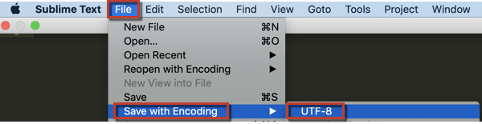

This article provides a fix for when you receive the error message "CSV files must use UTF-8 encoding." This error message means that the file you're trying to upload contains illegal characters, or characters that aren't allowed. While UTF-8 encoding allows for [the majority of characters](http://www.fileformat.info/info/charset/UTF-8/list.htm), some aren't compatible with Magento BI.

To fix the problem, you'll need to change the encoding of the file. Re-saving the file with the proper encoding typically resolves the issue, but be aware that you may lose some information (for example, the illegal characters may be dropped) when doing this.

We recommend using [Sublime Text](http://www.sublimetext.com/2) to save and encode the file.

1. Open your file in Microsoft Excel, Google Docs, Apple Numbers, or your program of choice.
1. Click ​​ **File** > **Save as** ​​ and choose the ​​ **Comma separated values (.csv)** format to save the file.
1. Open the CSV file in Sublime Text.
1. In Sublime Text, navigate to ​​ **File** > **Save with Encoding** > **UTF-8\*​** . This will save the CSV file with UTF-8 encoding.        
1. [Upload the data](https://docs.magento.com/mbi/data-analyst/importing-data/connecting-data/using-file-uploader.html) (in our user guide) to a new table in Magento BI.
