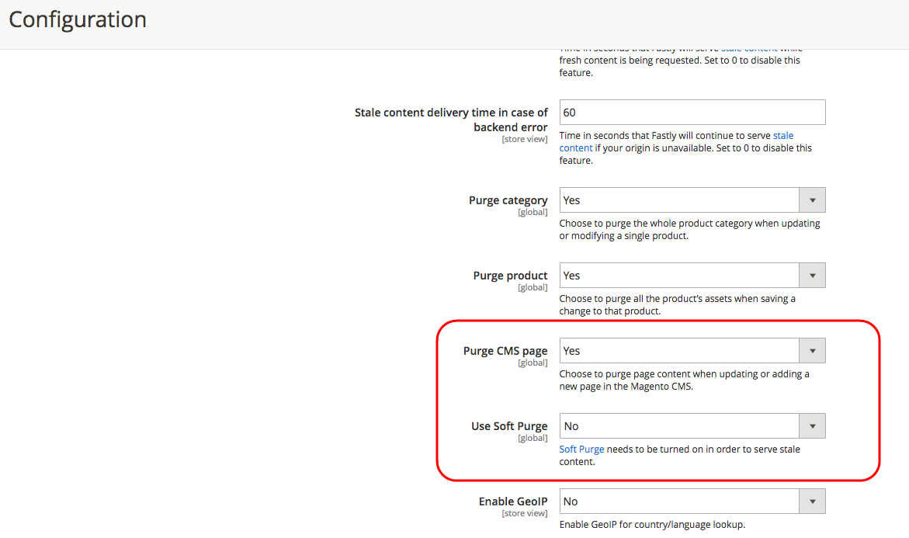

This article provides a fix for when Adobe Commerce stores do not display scheduled updates when using Content Staging and Fastly. The issue is due to default enabled Fastly Soft Purge. This feature reduces application resource load and only regenerates a fresh cache on a second request. To resolve, you can enable Purge CMS page through the Commerce Admin to always regenerate and serve fresh content.

## Issue

Scheduled updates for a store content asset (page, product, block, etc.) are not displayed on storefront immediately after the start time of the update. This happens when updates have been scheduled using the [Content Staging](http://docs.magento.com/m2/ee/user_guide/cms/content-staging.html) functionality.

## Cause

Due to Fastly's Soft Purge functionality (enabled by default), the Adobe Commerce storefront still receives the old (stale) cached content when sending **the first** request for the updated asset to Fastly. Fastly requires a second request to regenerate the site data.

As a result, Fastly may serve stale content until the second request for the updated content.

 **Expected caching:** After we schedule an update for a content asset using Content Staging, Adobe Commerce sends a request to update the cache to Fastly. Fastly invalidates the previous cached content (without deleting the content) and starts serving the updated content.

 **Actual caching:** If Fastly still serves the stale content when receiving **the first** request for the updated content, it will only send regenerated, correct content only after receiving **the second** request. This behavior has been implemented to reduce server load by renewing the cache only in areas with proven traffic, without regenerating the cache for the entire website. Fastly updates the cache gradually, saving the application resources.

## Solution

If serving stale content even for the first request is unacceptable, you may disable Soft Purge and enable Purge CMS page:

1. Log in to your local Commerce Admin as an administrator.
1. Go to **Stores** > **Configuration** > **Advanced** > **System** > **Full Page Cache**.
1. Expand **Fastly Configuration**, then expand **Advanced**.
1. Set **Use Soft Purge** to *No*.
1. Set **Purge CMS page** to *Yes*.
1. Click **Save Config** at the top of the page.

## Related documentation

* [Configure purge options](http://devdocs.magento.com/guides/v2.2/cloud/access-acct/fastly.html#purge) in our developer documentation.
* [Content Staging](http://docs.magento.com/m2/ee/user_guide/cms/content-staging.html) in our user guide.
* [Serving stale content](https://docs.fastly.com/guides/performance-tuning/serving-stale-content) in Fastly documentation.
