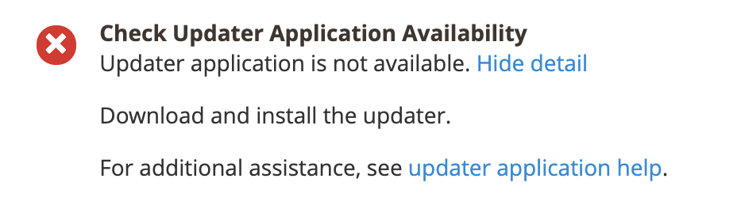

This article talks about the solution for the "updater application is not available" issue you might face when trying to update/install Adobe Commerce on-premises using the Web Setup Wizard.

## Issue

The following message is displayed in the readiness check:

## Affected products/versions

* Adobe Commerce on-premises 2.2.x, 2.3.x
* Magento Open Source 2.2.x, 2.3.x

## Solution

To resolve this issue, see if there is a `<magento_root>/update` directory that contains files and subdirectories. Otherwise, see [Set up the updater](https://devdocs.magento.com/guides/v2.3/comp-mgr/updater/update-updater.html) in our developer documentation.
