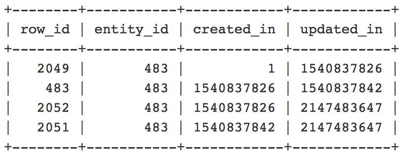

This article provides a patch for the known Adobe Commerce 2.2.3 issue where editing the end date or time of a catalog price rule schedule update results in adding duplicate entries to the `catalogrule` table and errors in the `catalogrule_rule` (Catalog rule product) indexer reindex.

## Issue

When you change the end date or time of an existing catalog price rule schedule update, duplicate entries are created in the `catalogrule` database table. As a result, the `catalogrule_rule` reindex fails with the following error in the exception log: *Item with the same ID already exists*.

 <span class="wysiwyg-underline">Steps to reproduce</span>:

Prerequisites: The `catalogrule_rule` indexer is set to *[Update on Schedule](https://support.magento.com/hc/en-us/articles/360040227191-Indexers-Update-On-Schedule-optimizes-Magento-performance-)* mode.

1. In the Commerce Admin, create a new Catalog Price Rule under **Marketing** > **Promotions** > **Catalog Price Rule**.
1. In the **Catalog Price Rule** grid, click **Edit**, and schedule a new Update and set **Status** to *Active.*
1. Click **View/Edit** next to the newly created Update and change the end date to an earlier time.
1. Save the Update.
1. Run the reindex command for the `catalogrule_rule` indexer.

 <span class="wysiwyg-underline">Expected result</span>: 
 
 The `catalogrule_rule` indexer is reindexed successfully. No duplicate entries in the `catalogrule` table.

 <span class="wysiwyg-underline">Actual result</span>: 
 
 Reindex fails with the following error: *Item with the same ID already exists*, because there are duplicate entries in the `catalogrule` table.

## Solution

To solve the issue you need to apply the attached patch and remove the existing duplicated entries. See the [Remove duplicated entries](#remove) section for details about checking if the duplicates exist and removing them.

## Patch

The patch is attached to this article. To download it, scroll down to the end of the article and click the file name, or click the following link:

 [Download MDVA-10974\_EE\_2.2.3\_COMPOSER\_v2.patch](assets/MDVA-10974_EE_2.2.3_COMPOSER_v2.patch.zip)

### Compatible Adobe Commerce versions:

The patch was created for:

* Adobe Commerce 2.2.3

The patch is also compatible (but might not solve the issue) with the following Adobe Commerce versions and editions:

* Adobe Commerce on cloud infrastructure 2.2.1 - 2.2.5
* Adobe Commerce on-premises 2.2.1 - 2.2.2, and 2.2.4 - 2.2.5

## How to apply the patch

See [How to apply a composer patch provided by Adobe](https://support.magento.com/hc/en-us/articles/360028367731) for instructions in our support knowledge base.

<h2 id="remove">Remove duplicated entries</h2>

>![info]
>
>Please make sure to have a recent backup before any manipulations.

Take these steps to locate the duplicated entries and delete them:

1. Run the following query to check if the duplicated entries exist in the database:
    ```SQL
    SELECT entity_id, "catalog_product_entity" AS entity_table FROM catalog_product_entity GROUP BY entity_id, created_in HAVING COUNT(*) > 1    UNION    SELECT entity_id, "catalog_product_entity" AS entity_table FROM catalog_product_entity group by entity_id, updated_in having count(*) > 1    UNION    SELECT rule_id as entity_id, "catalogrule" AS entity_table FROM catalogrule GROUP BY entity_id, created_in HAVING COUNT(*) > 1    UNION    SELECT rule_id as entity_id, "catalogrule" AS entity_table FROM catalogrule GROUP BY entity_id, updated_in HAVING COUNT(*) > 1    UNION    SELECT rule_id as entity_id, "salesrule" AS entity_table FROM salesrule GROUP BY entity_id, created_in HAVING COUNT(*) > 1    UNION    SELECT rule_id as entity_id, "salesrule" AS entity_table FROM salesrule GROUP BY entity_id, updated_in HAVING COUNT(*) > 1    UNION    SELECT page_id as entity_id, "cms_page" AS entity_table FROM cms_page GROUP BY entity_id, created_in HAVING COUNT(*) > 1    UNION    SELECT page_id as entity_id, "cms_page" AS entity_table FROM cms_page GROUP BY entity_id, updated_in HAVING COUNT(*) > 1    UNION    SELECT block_id as entity_id, "cms_block" AS entity_table FROM cms_block GROUP BY entity_id, created_in HAVING COUNT(*) > 1    UNION    SELECT block_id as entity_id, "cms_block" AS entity_table FROM cms_block GROUP BY entity_id, updated_in HAVING COUNT(*) > 1;
    ```
    If there are no duplicate entries, the response will be empty and you do not have to do anything else. If the duplicated entries exist, you will get the table name and `entity_id` of the duplicated entity, like in the one in following example:

    

    Please consider that in certain tables the name of the field with entity id will be different from `entity_id`. For example, in the `cms_page` table, it would be `page_id` instead of `entity_id`.
1. Next, you need to take a closer look on the duplicates and to understand which should be removed. Use a query similar to the following to see the duplicates. Replace the table name, entity id name and value according to the results received on the previous step.
    ```sql
    SELECT * FROM catalog_product_entity WHERE entity_id = 483 ORDER BY created_in;
    ```    
    You will receive a list of records with multiple columns. You would need to look at the following four: `row_id`, `entity_id`, `created_in`, `updated_in`. Example:

    

    The `created_in` and `updated_in` values should follow this pattern: the `created_in` value of the current row is equal to the `updated_in` value in the previous row. Also, the **first row** should contain created\_in = 1 and the **last row** should contain updated\_in = 2147483647. (If there's only 1 row, you must see created\_in=1 **and** updated\_in=2147483647). The row(s) for which this pattern is broken, should be deleted. In our example it would be the row with `row_id` =2052.
1. Delete the duplicate using a query similar to the following. Replace the table name, entity id name and value according to the results received on the previous steps:
    ```sql
    DELETE FROM catalog_product_entity WHERE entity_id = 483 AND row_id = 2052;
    ```    
1. Clean cache by running:
    ```bash
    bin/magento cache:clean
    ```   
    or in the Commerce Admin under **System** > **Tools** > **Cache Management**.

## Useful links in our developer documentation

* [Apply custom patches to Adobe Commerce on cloud infrastructure](https://devdocs.magento.com/guides/v2.3/cloud/project/project-patch.html)
* [View and manage logs for Adobe Commerce on cloud infrastructure](https://devdocs.magento.com/cloud/project/log-locations.html)

## Attached Files
