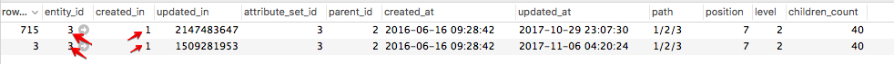

This article provides a fix for when updating product categories via the Commerce Admin, the changes are not displayed on the Admin and storefront. The problem is caused by the corrupted data in the `catalog_category_entity` table. To solve the issue, fix or remove the problematic category update records in the table. After that, you should be able to update product categories using the Admin.

## Issue

After making changes to a product category in the Admin and saving, the new updates are neither saved nor displayed in the Admin and storefront.

### Steps to reproduce

1. Go to **Catalog** > **Categories**.
1. Select a category.
1. Make changes, then click **Save**.
1. The message is displayed: *You saved the category*.
1. Notice that the change you've made has not been saved.

## Possible cause: corrupted data in the `catalog_category_entity` table

The issue is caused by the same values in the `created_in` column of the affected category records in the database (DB).

Details:

* The `catalog_category_entity` DB table has two or more records for the affected category (these records have the same `entity_id` value).
* These category records have **the same values in the `created_in` column**.

### How does the second DB entry (and all the next ones) appear in DB for one and the same category?

The second DB record (and, possibly, the next ones) for the affected category means there have been category updates scheduled using the Magento\_Staging module. The module makes an additional record for a category in the `catalog_category_entity` and that is the expected application behavior; the problem is that the records have the same values for the `created_in` column.

### How do the same values appear?

We cannot state the reasons for data corruption with certainty. The possible reasons may include:

* customizations (code, themes, etc.)
* incorrect data migration
* incorrect data restore from backup

To the best of our knowledge, such data corruption is not typical for the "clean" (out-of-the-box) Adobe Commerce instance and cannot be reproduced on an Adobe Commerce installation with no customizations.

### How to verify this is your issue

The `catalog_category_entity` table should have multiple records for the affected category (records should have the same `entity_id` value) and at least two of those records should have the same `created_in` values. With this, the Staging-scheduled updates would not be displayed in the Commerce Admin; you would only see the empty Scheduled Changes block.

#### Steps to verify

1. Access the catalog\_category\_entity table in your database.
1. Filter entities by entity\_id, with entity\_id identifying the affected category.
1. If the values in the created\_in column are the same for different entries with the same entity\_id, that's our case. Normally, the `created_in` values are different for every record.

## Solution

You may choose one of the following solutions:

1. **Delete** the problematic category update records
1. **Repair** the problematic category update records

### Delete the problematic category update records

In this solution, you will need to set the correct `updated_in` value for the initial category record and delete all other records for this category. This removes all scheduled category updates.

Follow these steps:

1. Find the DB records with the `entity_id` of the affected category.
1. Select the record with the biggest integer in the `updated_in` column.
1. Copy the `updated_in` value from the selected record.
1. Select the record with `row_id` = `entity_id` (initial category record) and paste the copied value to the `updated_in` column of this record.
1. Delete row(s) with `row_id` not equal to `entity_id` .

### Repair the problematic category update records

1. Find the category records with the same `entity_id` and the same `created_in` value.
1. Select the record where `row_id` = `entity_id` and copy the `updated_in` value.
1. Select the record where `row_id` is not equal to `entity_id` and paste the copied `updated_in` value as the `created_in` value. See the screenshot below as an illustration.        
1. Verify that the category update record, the `created_in` value of which you have updated (in step 3), exists in the `staging_update` table. *For example:* IF the copied `created_in` value is 1509281953, THEN the entity with `row_id` = 1509281953 must exist in the `staging_update` table
