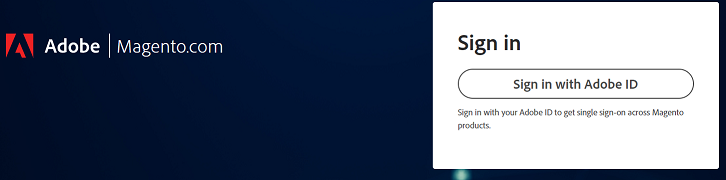
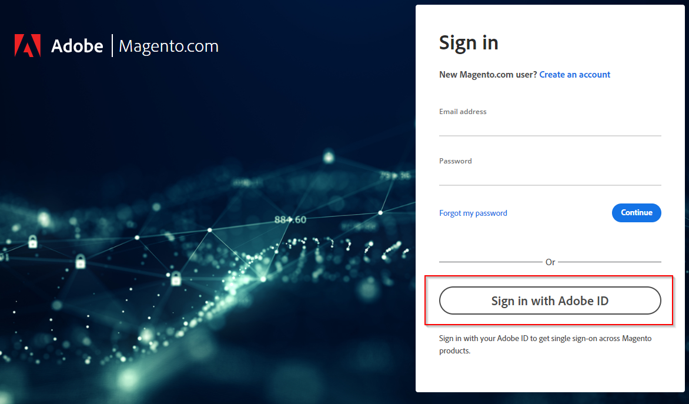

This article provides a solution for when you struggle to log in to Adobe Commerce support or your cloud project.

## Affected products and versions
Adobe Commerce (all deployment methods) all [supported versions](https://support.magento.com/hc/en-us/articles/360048550332#:~:text=all%20supported%20versions)

## Issue

When you go to 'https://account.magento.com/customer/account/login/' or 'https://accounts.magento.cloud/user' you might notice that there is now a unified login form and you are no longer able to enter your credentials like you have previously.

<ins>Steps to reproduce</ins>:

Try to log in to your Commerce account.

<ins>Expected result</ins>:

Logging in successfully.

<ins>Actual result</ins>:

Get redirected to a page to sign in with an Adobe account and credentials do not work.

## Cause

As part of our process of integrating Adobe Commerce with other Adobe solutions, all users will need to create an Adobe login - if they do not already have one - using the same email address connected to their MageID.

## Solution

You may log in to the account with a) an existing Adobe corporate/personal account or b) if you do not have an Adobe account, create one with the same email address.
For steps refer to [Commerce Identity Manager](https://experienceleague.adobe.com/docs/commerce-admin/start/commerce-account/commerce-identity-manager.html?lang=en) in Adobe Experience League.
