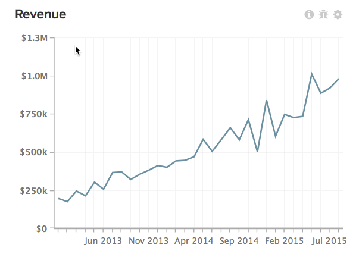
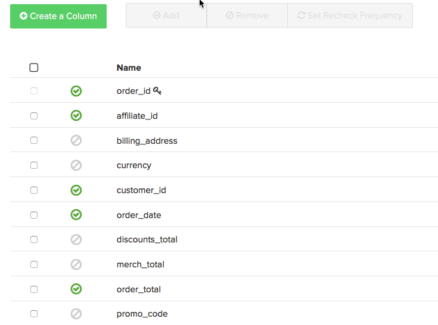

This article provides solutions for troubleshooting discrepancies in your Magento BI data. Data Exports are a useful tool for comparing your Magento BI data to your source data in order to pinpoint data discrepancies in your reports, especially if the [data discrepancy diagnostic checklist](https://support.magento.com/hc/en-us/articles/360016731271-Diagnosing-a-data-discrepancy) didn't help you pinpoint the problem. This article will walk you through a real-life example of how data discrepancies can be pinpointed using Data Exports.

Take this analysis, for example:

There’s a suspicious dip in November 2014. $500,780.94 in revenue? That doesn't sound right. You've confirmed that there’s more revenue showing for the month of November 2014 in your source database, and you've double-checked that the **Revenue** metric used in this report is correctly defined. It seems that the data in the Magento BI data warehouse is incomplete which can be confirmed using a Data Export.

<h2 id="export">Exporting the data</h2>

To get started, click the gear in top right corner of the chart and then the Raw Export option in the dropdown menu. This will give you a raw export of the data behind the chart.

In the Raw Data Export menu, you can select the table to export from along with the columns to include in the export. Filters can also be applied to the result set.

In our example, the **Revenue** metric used on this report uses the **order\_total** field defined on the **orders** table, using the **date** as its timestamp. In our export, we want to include all **order\_id** values for November 2014 and their **order\_total** . The **Revenue** metric doesn’t use any filters, but we'll add a filter to the export to limit the result set to just November 2014.

Here’s what the Raw Data Export menu looks like for this example:

Click Export Data to begin the export. A window with the details of the export, including the status, will display. Prepping the export takes a few minutes, which makes now a good time to perform an analogous extract of our source data for November 2014, including **date, order\_id** , and the **order\_total** . We'll open this file in Excel and leave it up, as we’ll come back to it shortly.

When the Download button appears on the Raw Data Exports window, click it to download the zip file containing the CSV file.

At this point, we need to get all the data into one sheet to find the problem. We'll import the CSV file (the export from Magento BI) into a different sheet of the Excel file containing our source data.

<h2 id="pinpoint">Pinpointing the problem</h2>

Now that all the data is in one place, we can look for the source of the discrepancy. Comparing the number of rows in each sheet will help us pinpoint the problem. Let's take a closer look at each situation.

#### Both sheets contain the same number of rows

If both systems have the same row count and the **Revenue** metric isn’t matching the source data, then the **order\_total** must be off somewhere. It’s possible that the **order\_total** field has been updated in your source database and Magento BI isn’t picking up these changes.

To confirm this, take a look at whether or not the **order\_total** column is being rechecked. Head to the Data Warehouse Manager and click the orders table. You’ll see the [recheck frequency](https://support.magento.com/hc/en-us/articles/360016506452-Configuring-data-rechecks) listed in the ‘Changes?’ column. The **order\_total** field should be set to recheck as often as it is expected to change; if it’s not, go ahead and set it to your desired recheck frequency.

#### 

If the recheck frequency is already set correctly, then something else is wrong. Refer to the [Contacting Support section](#support) at the end of this article for next steps.

<h2 id="morerows">The source database has MORE rows than Magento BI</h2>

If the source database has more rows than Magento BI and the gap is greater than the number of orders that you can expect to come in during the length of an update cycle, there may be a connection issue. This means that Magento BI isn’t able to pull in new data from the source database, which can happen for several reasons.

Navigate to the Connections page and take a look at the status of the data source containing the order table:

1. **If the status is Re-auth** , the connection isn’t using the correct credentials. Click into the connection, enter the correct credentials, and retry.
1. **If the status is Failed** , the connection may not be setup properly on the server side. Failed connections usually arise from an incorrect host name or the target server not accepting connections on the specified port.Click into the connection and double-check the spelling of the hostname and that the correct port is entered. On the server side, make sure that the port can accept connections and that your firewall has the Magento BI IP address (54.88.76.97/32) as allowed. **If the connection continues to fail** , refer to the [Contacting Support section](#support) at the end of this article for next steps.
1. **If the status is Successful** , then the connection isn’t the problem and RJ support needs to get involved. Refer to the [Contacting Support section](#support) at the end of this article for next steps.

<h2 id="lessrows">The source database has FEWER rows than Magento BI</h2>

If the source database has fewer rows than Magento BI, then it’s possible that rows are being deleted from the source database and Magento BI isn’t picking up these deletions. ** [Deleting data](https://support.magento.com/hc/en-us/articles/360016731631-Optimizing-your-database-for-analysis#delete) can lead to discrepancies, lengthier update times, and a slew of logistical headaches** , so we strongly recommend you don’t ever delete data unless it’s really necessary.

If, however, rows are deleted from the table, take a look at the recheck frequency on the primary key. Rechecking the primary key means that the table will be checked for deleted rows.

In the Data Warehouse Manager, primary key columns are marked with a key symbol. In our example, the primary key is the **order\_id** column:

If the primary key is already set to be rechecked or rows are never deleted from this table, then you’ll need RJ support to pinpoint the problem. Refer to the following section for next steps.

<h2 id="support">Contacting Support</h2>

If you aren't able to pinpoint the source of the problem, you'll need to loop in RJ Support. Before you submit a ticket, please do the following:

* **If your source database and Magento BI have the same number of rows** and recheck frequencies are set correctly, perform a VLOOKUP in your spreadsheet **to find which order\_id values have a different order\_total value between Magento BI and your source database.** Include these values when you submit your ticket.
* **If your source database has MORE rows than Magento BI** and the connection shows as Successful or continues to fail, we'll need to know the name of the connection and the error message you're seeing, if there is one.
* **If your source database has FEWER rows than Magento BI,** rows aren't deleted from the table, and recheck frequencies are set correctly, perform a VLOOKUP in your spreadsheet **to find which order\_id values are in Magento BI** but not in your source database. Include these values when you submit your ticket.

## Related

* [Data discrepancy diagnostic checklist](https://support.magento.com/hc/en-us/articles/360016731271-Diagnosing-a-data-discrepancy)
* [Submitting a data discrepancy ticket](https://support.magento.com/hc/en-us/articles/360016506472-Submitting-a-data-discrepancy-ticket)

