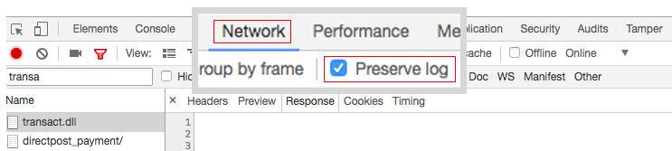
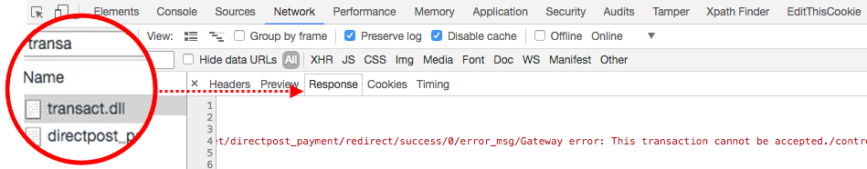

This article provides a fix for "*An error occurred on the server*" error message when placing an order using Authorize.Net Direct Post.

>![warning]
>
>**Deprecation Notice**  
Due to the Payment Service Directive [PSD2](https://docs.magento.com/user-guide/v2.3/stores/compliance-payment-services-directive.html) and the continued evolution of many APIs, Authorize.Net is at risk of becoming outdated and no longer security compliant in the future. For this reason, it is now deprecated, and we are recommending that you disable it in your Adobe Commerce configuration and transition to the corresponding [Commerce Marketplace extension](https://marketplace.magento.com/extensions.html).
>
>**This integration is removed from the Adobe Commerce 2.4.0 release and has been deprecated from the current versions of 2.3.**
>
>For details about making a secure transition from deprecated payment integrations, see our [DevBlog](https://community.magento.com/t5/Magento-DevBlog/Deprecation-of-Magento-core-payment-integrations/ba-p/426445).

## Issue

Placing an order using [Authorize.Net Direct Post](https://docs.magento.com/user-guide/v2.3/payment/authorize-net-direct-post.html) Sandbox account causes an error message:

>
"An error occurred on the server. Please try to place order again"

## Cause 1: Testing Mode is enabled

It does not seem obvious, but the Authorize.net's **Testing Mode** setting must be set to **No** even when testing with the Sandbox account.

## Solution 1: disable Testing Mode

1. Go to **Stores** > **Configuration** > **Sales** > **Payment Methods** > **Other Payment Methods** > **Authorize.net Direct Post**.
1. Set **Test Mode** to "No" (uncheck **Use system value**, then select "No" in the menu).
1. Click **Save Config**.

## Cause 2: Incorrect URL's

The Authorize.net settings might contain incorrect URL addresses for the critical Authorize.Net resources.

## Solution 2: Provide correct URL's

* **Gateway URL:**   `https://test.authorize.net/gateway/transact.dll`
* **Transaction Details URL:**   `https://apitest.authorize.net/xml/v1/request.api`
* **API Reference:**   `https://developer.authorize.net/api/reference/`

## If nothing helped: get debug info

If placing an order with Authorize.net fails with a non-informative *"Something went wrong"* error, check the Adobe Commerce `debug.log`.

### Transact.dll

In case the `debug.log` is empty, check the **transact.dll** response in your web browser's console:

1. Open the console.
1. Before placing an order, go to the **Network** tab and select **Preserve log**.        
1. Filter responses by **transact.dll** to see a response message with a possible error.        
