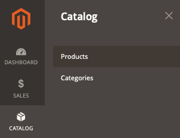

This article provides solutions for when products are not displayed on storefront.

## Affected products and versions

* Adobe Commerce on-premises X.X.X
* Adobe Commerce on cloud infrastructure X.X.X

## Issue

<ins>Steps to reproduce</ins>:

1. Log in to the Commerce Admin.
1. Go to **Catalog** > **Products**.

    

1. Click **Add Product** and go through the product creation process. Or import products from a CSV file.

<ins>Expected result</ins>:

Product is displayed on the storefront.

<ins>Actual result</ins>:

Product is not displayed.

## Cause

This can be caused by a number of reasons. Please follow the steps below to check the main points that could help to identify and solve the problem.

## Solution

Each of the following points might solve the issue.

* Check product settings in Admin. Go to **Catalog** > **Products**, open the product page and make sure the following fields are correctly configured:
    * **Enable Product** = *Yes.*
    * **Stock Status**: *In Stock*. Or if *Out of Stock* is the correct value, make sure that **Display Out of Stock Products** (**STORES** > **Settings** > **Configuration** > **CATALOG** > **Inventory** > **Stock Options** > **Display Out Of Stock Products**) is set to *Yes* (configured on global level).
    * **Categories**: If you try to find the product on a category page, verify that the product is assigned to the category. To simplify troubleshooting, create a new category from the current page and assign a product to it.
    * **Visibility** = *Catalog, Search.*
    * In the **Product in Websites** section, make sure the product is assigned to the correct website.
    * Switch the scope selector to the store view where you try to find your product on the storefront, and verify the same settings.
* Perform the full reindex, by running `bin/magento indexer:reindex` from the console, and flush all cache in the Admin, under **System** > **Tools** > **Cache Management**, or from the console by running `bin/magento cache:clean`.
* If the above does not help, you can start further investigation by checking logs in the `var/log` directory.

## Related reading in our support knowledge base

* [Log locations (directories) for Pro architecture](https://support.magento.com/hc/en-us/articles/360000318834)
* [Log locations (directories) for Starter architecture](https://support.magento.com/hc/en-us/articles/360020127552-Log-locations-directories-for-Starter-plan)
